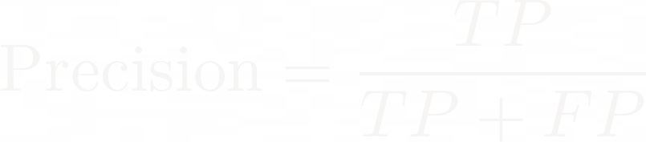

<script src="index_files/core-js/shim.min.js"></script>

<script src="index_files/react/react.min.js"></script>

<script src="index_files/react/react-dom.min.js"></script>

<script src="index_files/reactwidget/react-tools.js"></script>

<script src="index_files/htmlwidgets/htmlwidgets.js"></script>

<link href="index_files/reactable/reactable.css" rel="stylesheet" />
<script src="index_files/reactable-binding/reactable.js"></script>

<script src="index_files/htmlwidgets/htmlwidgets.js"></script>

<script src="index_files/plotly-binding/plotly.js"></script>

<script src="index_files/typedarray/typedarray.min.js"></script>

<script src="index_files/jquery/jquery.min.js"></script>

<link href="index_files/crosstalk/css/crosstalk.min.css" rel="stylesheet" />
<script src="index_files/crosstalk/js/crosstalk.min.js"></script>

<link href="index_files/plotly-htmlwidgets-css/plotly-htmlwidgets.css" rel="stylesheet" />
<script src="index_files/plotly-main/plotly-latest.min.js"></script>

<script src="index_files/htmlwidgets/htmlwidgets.js"></script>

<script src="index_files/plotly-binding/plotly.js"></script>

<script src="index_files/typedarray/typedarray.min.js"></script>

<script src="index_files/jquery/jquery.min.js"></script>

<link href="index_files/crosstalk/css/crosstalk.min.css" rel="stylesheet" />
<script src="index_files/crosstalk/js/crosstalk.min.js"></script>

<link href="index_files/plotly-htmlwidgets-css/plotly-htmlwidgets.css" rel="stylesheet" />
<script src="index_files/plotly-main/plotly-latest.min.js"></script>

<script src="index_files/htmlwidgets/htmlwidgets.js"></script>

<script src="index_files/plotly-binding/plotly.js"></script>

<script src="index_files/typedarray/typedarray.min.js"></script>

<script src="index_files/jquery/jquery.min.js"></script>

<link href="index_files/crosstalk/css/crosstalk.min.css" rel="stylesheet" />
<script src="index_files/crosstalk/js/crosstalk.min.js"></script>

<link href="index_files/plotly-htmlwidgets-css/plotly-htmlwidgets.css" rel="stylesheet" />
<script src="index_files/plotly-main/plotly-latest.min.js"></script>

<script src="index_files/htmlwidgets/htmlwidgets.js"></script>

<script src="index_files/plotly-binding/plotly.js"></script>

<script src="index_files/typedarray/typedarray.min.js"></script>

<script src="index_files/jquery/jquery.min.js"></script>

<link href="index_files/crosstalk/css/crosstalk.min.css" rel="stylesheet" />
<script src="index_files/crosstalk/js/crosstalk.min.js"></script>

<link href="index_files/plotly-htmlwidgets-css/plotly-htmlwidgets.css" rel="stylesheet" />
<script src="index_files/plotly-main/plotly-latest.min.js"></script>

<script src="index_files/htmlwidgets/htmlwidgets.js"></script>

<script src="index_files/plotly-binding/plotly.js"></script>

<script src="index_files/typedarray/typedarray.min.js"></script>

<script src="index_files/jquery/jquery.min.js"></script>

<link href="index_files/crosstalk/css/crosstalk.min.css" rel="stylesheet" />
<script src="index_files/crosstalk/js/crosstalk.min.js"></script>

<link href="index_files/plotly-htmlwidgets-css/plotly-htmlwidgets.css" rel="stylesheet" />
<script src="index_files/plotly-main/plotly-latest.min.js"></script>

{}
💾 <a href="https://www.kaggle.com/datasets/mlg-ulb/creditcardfraud?resource=download" target="_blank">Download the data</a>

### TL;DR

I trained a model to detect fraudulent credit card transactions, even though fraud made up less than 1% of the data. By carefully adjusting decision thresholds and evaluating metrics like precision and recall, I built a classifier that caught 80% of fraud cases while keeping false alarms low—demonstrating how machine learning can support real-world risk detection and help balance business costs associated with fraud and customer experience.

### Key Skills

- 🌲 **Ensemble Learning with Random Forests** – Trained and tuned a Random Forest classifier to detect rare fraud cases in heavily imbalanced data

- ⚖️ **Imbalanced Classification** – Used precision–recall curves and threshold tuning to optimize detection of minority-class events

- 📉 **Classifier Evaluation** – Interpreted ROC AUC, F1, and confusion matrices to balance recall and false positive rate in a high-stakes context

- 🧪 **Model Transparency & Risk Tradeoffs** – Explored threshold-setting as a policy lever, connecting model outputs to real-world operational goals and business costs
  \### What I Learned

### What I Learned

Balancing performance metrics like precision and recall with real-world business costs is crucial for building effective, practical fraud detection models.

{}

## <u>What I did</u>

Have you ever had that sinking feeling? *Wait, I didn’t buy that, what’s going on? Oh no…*

Fraud sucks. It’s one of the few things in the tech world that’s unequivocally
bad: people stealing money. No ethical grey areas; no “but it improves
engagement.” Just theft. The world would be better without fraud. Period.


But as far as data problems go? Fraud is awesome. It’s tidy. It’s well-structured. And — at least if you ask the person who owns the credit card — it’s pretty easy to label: either a transaction was fraudulent, or it wasn’t. Because of this binary nature (0 = legit, 1 = fraud), fraud detection is beautifully suited for modeling and machine learning.

I happen to love binary classification problems. There’s something so… crisp
about them. A light switch is either on or off. A coin lands on heads or tails.
*The Dark Knight* is either an extremely awesome movie — or the best movie of all
time.

That simplicity contrasts with continuous prediction problems, like guessing the
exact temperature tomorrow. There will always be some error — and my fellow
probability nerds know: the chance that a continuous variable hits one exact
value is literally zero. Thanks to floating-point precision, the odds that it’ll
be **exactly** 67.000000°F at 4:00 PM? Basically nil. It might be 67.1203948326490°F
instead.

Anyway, I took on this fraud prediction challenge for two reasons:

1)  I love classification, and

2)  I wanted to sharpen up my understanding of classifier performance metrics.

We’ll get into what those metrics are soon, but in short: they’re how we know whether the model’s actually doing its job. Spoiler: raw accuracy doesn’t cut it — especially when you’re trying to predict something rare, like fraud.

Let’s get into it.

## <u>How I did it</u>

I grabbed a credit card fraud dataset off of Kaggle, that you can find <a href="https://www.kaggle.com/datasets/mlg-ulb/creditcardfraud?resource=download" target="_blank">here.</a>

I’ll show snippets of the Python code I used to work with the data, but here’s
the first thing to know: this dataset comes fully preprocessed. That’s a big
deal, because in most real-world projects, cleaning and preparing the data takes
up like 80% of the work.

Think of it like this: someone already gutted and repainted the whole house (and
painting a whole house is the *worst*, by the way). All I had to do was move in
and decide where to put the furniture. Still important work — but major props to
the folks who did the heavy lifting on Kaggle.

Since I wanted to focus on modeling and evaluation, skipping the data wrangling made sense here.

For the full Python script, see [here](https://gist.github.com/dbraun31/63b629d5e932d48770c0a00c82f09683).

First, we load the relevant libraries and the data

<div class="show-default">

</div>

``` python
# Import libraries
import numpy as np
import pandas as pd
import joblib
import os
from sklearn.ensemble import RandomForestClassifier
from sklearn.model_selection import GridSearchCV, train_test_split
from sklearn.metrics import roc_auc_score, confusion_matrix, f1_score, classification_report

# Import data
d = pd.read_csv('post_data/creditcard.csv')
```

Next, I’m taking a peek at a subset of the rows and columns.

<div class="reactable html-widget html-fill-item" id="htmlwidget-1" style="width:auto;height:auto;"></div>
<script type="application/json" data-for="htmlwidget-1">{"x":{"tag":{"name":"Reactable","attribs":{"data":{"Time":[0,0,1,406,472,4462],"V1":[-1.3598071336738,1.19185711131486,-1.35835406159823,-2.3122265423263,-3.0435406239976,-2.30334956758553],"V2":[-0.0727811733098497,0.26615071205963,-1.34016307473609,1.95199201064158,-3.15730712090228,1.759247460267],"V3":[2.53634673796914,0.16648011335321,1.77320934263119,-1.60985073229769,1.08846277997285,-0.359744743330052],"V28":[-0.0210530534538215,0.0147241691924927,-0.0597518405929204,-0.143275874698919,0.0357642251788156,-0.153028796529788],"Amount":[149.62,2.69,378.66,0,529,239.93],"Class":[0,0,0,1,1,1]},"columns":[{"id":"Time","name":"Time","type":"numeric"},{"id":"V1","name":"V1","type":"numeric"},{"id":"V2","name":"V2","type":"numeric"},{"id":"V3","name":"V3","type":"numeric"},{"id":"V28","name":"V28","type":"numeric"},{"id":"Amount","name":"Amount","type":"numeric"},{"id":"Class","name":"Class","type":"numeric"}],"sortable":false,"defaultPageSize":10,"showPageSizeOptions":false,"paginationType":"numbers","highlight":true,"theme":{"color":"#fff","backgroundColor":"#252627","borderColor":"var(--borders)","stripedColor":"rgba(0, 0, 0, 0.02)","highlightColor":"rgba(0, 0, 0, 0.05)","style":{"fontSize":"0.95em"},"pageButtonStyle":{"background":"transparent","color":"inherit","border":"1px solid #ccc","borderRadius":"4px","padding":"4px 8px","margin":"0 2px"},"pageButtonHoverStyle":{"background":"#ddd"},"pageButtonActiveStyle":{"background":"#bbb","fontWeight":"bold"}},"dataKey":"e164eedf1638d6b5eacfd92d07d8e3ae"},"children":[]},"class":"reactR_markup"},"evals":[],"jsHooks":[]}</script>

In reality, we have columns `V1` through `V28`. There’s also `Time`, which represents
the time elapsed since the previous transaction, `Amount`, which is the dollar
amount of the transaction, and `Class`, which is our target label: `0` for legit, `1`
for fraud.

Now — you might look at the table preview and think, “Huh, looks like fraud is
about as common as normal transactions.”

**Not even close.**

Only 0.17% of the 284807 transactions in this dataset
are actually fraudulent. For demonstration purposes, I’ve just selected an equal
number of legit and fraud rows to show side-by-side. That balance makes it
easier to eyeball patterns — but it’s not how the full dataset looks.

You’ll also notice all those `V` columns — `V1` through `V28`. These are the result of
PCA transformations on the original transaction data.

Explaining PCA fully would take more than a sentence, but here’s the gist: PCA
is like Marie Kondo for your dataset. It takes a messy pile of potentially
correlated variables and distills them into a few compact, uncorrelated
components that still capture most of the action — so you can model smarter with
less clutter. And because these components are combinations of the original
inputs, they don’t reveal sensitive details directly, which makes PCA a handy
privacy-preserving step too.

I’m simplifying things a bit below by only including the `V` variables (dropping
`Time`), and separating `Class` into its own vector that I’ll use for modeling.
At this point I’m also stratifying the data into training and testing sets.

As mentioned earlier, we’re dealing with *heavily imbalanced classes* — the vast
majority of transactions are legit, and only a tiny fraction are fraud. This
imbalance can really trip up many classifiers, so we need to make a few
adjustments to help the model out.

First, I use `stratify = y` when splitting the data. This ensures that both the
training and testing sets contain the same proportion of fraud cases — crucial
when those cases are rare. Without this, your test set could end up with almost
no fraud at all, making it useless for evaluation.

<div class="show-default">

</div>

``` python

# --- FORMAT DATA --- #

# Leave out time
features = [x for x in d.columns if x not in ['Time', 'Class']]

X = d[features].to_numpy()
y = d['Class'].to_numpy()

# Stratify y to ensure that the very few positive observations are balanced 
# across train and test
X_train_full, X_test, y_train_full, y_test = train_test_split(
        X, y, stratify=y, random_state=42
)
```

Next comes the tricky part: actually balancing the data for training.

There are several strategies here, but I went with *undersampling* the majority
class. Here’s a quick analogy: imagine you’re filling a bag with red and blue
marbles. You’ve got way more blue than red. To get a balanced bag, you can keep
all the red marbles and randomly select just as many blue ones. Boom — balance
achieved.

That’s exactly what I did. I kept all the fraud cases (the rare red marbles),
and randomly sampled an equal number of legit transactions (the common blue
marbles). This gives me a balanced training set with a 50/50 class split.

<div class="show-default">

</div>

``` python
# --- RESAMPLE --- #

# Separate legit and fraud classes
idx_legit = np.where(y_train_full==0)[0]
idx_fraud = np.where(y_train_full==1)[0]

# Choose only the number of legit observations as there are fraudulent cases
idx_legit_sampled = np.random.choice(idx_legit, size=len(idx_fraud),
                                     replace=False)

# Put the indices back together and shuffle
idx = np.concat([idx_legit_sampled, idx_fraud])
np.random.shuffle(idx)

# Subsample to make balanced training data
X_train = X_train_full[idx]
y_train = y_train_full[idx]
```

Now it’s time to train the model. I’m going with a random forest, which is a fancy way of saying “a whole bunch of decision trees working together as a team.” This ensemble method is a classic for fraud detection, and for good reason — it’s fast, handles messy data well, and can capture complex patterns without too much tuning.

To make sure my trees aren’t just memorizing the training data (aka
*overfitting*), I’m tuning a couple of important knobs using *k-fold cross-validation* — basically a systematic way of testing how well the model
might generalize to unseen data.

The first knob is `max_depth`, which controls how deep each tree is allowed to grow. Think of a super deep tree like a conspiracy theorist — it connects everything with high confidence, but often gets it wrong in the real world. We want trees that are smart, but not paranoid.

The second knob is `min_samples_leaf`, which says “Hey, don’t end a decision path unless you’ve seen at least this many examples.” A higher value here helps smooth things out and prevents the model from latching onto quirks in tiny subgroups.

I’m building a forest with 300 trees — plenty to capture stable patterns without pushing my laptop into meltdown. In general, more trees = better performance, but also more compute time. So I’m balancing performance and pragmatism here.

<div class="show-default">

</div>

``` python

# --- FIT RANDOM FOREST WITH GRID SEARCH CV --- #

param_grid = {
    'max_depth': [5, 10, 20, None],
    'min_samples_leaf': [1, 5, 10]
}

grid = GridSearchCV(RandomForestClassifier(n_estimators=300),
                    param_grid,
                    scoring='roc_auc',
                    cv=5)


# Load from file if it exists to reduce processing time
if not os.path.exists('post_data/grid.pkl'):
    grid.fit(X_train, y_train)
    joblib.dump(grid, 'post_data/grid.pkl')
else:
    grid = joblib.load('post_data/grid.pkl')
```

Next up, I take the trained model and let it loose on the test data. Unlike the
balanced training set, this test data reflects the real-world class imbalance —
way more legit transactions than fraud. That’s important! It means we’re now
evaluating the model under the same conditions it would face in the wild. If it
can spot fraud here, it’s doing something right.

What I’m getting back from the model are two things:

- `y_pred`: which are the final yes-or-no predictions about whether a transaction is fraud, and

- `y_proba`: which are the model’s estimated probabilities that each transaction is fraud.

Now, `y_pred` is what we ultimately care about—it’s the model making a decision.
But having access to `y_proba` gives me a lot more flexibility. Instead of being
locked into a single cutoff (like “anything over 0.5 = fraud”), I can explore
different thresholds and see how the model performs across the board. That’s
super helpful for tuning model evaluation metrics, which we’ll see next.

``` python
# --- PREDICT ON TEST DATA --- #

# Both classification and probabilities
y_pred = grid.predict(X_test)
y_proba = grid.predict_proba(X_test)[:, 1]
```

## <u>What I found</u>

Now it’s time to see how well the model did at spotting fraud in the test set.
Since one of my goals with this project was to brush up on classifier evaluation
metrics, I decided to write my own instead of relying on the built-in ones from
`sklearn`. I find that rolling my own forces me to really understand what’s going
on under the hood.

Performance metrics for binary classification can be deceptively tricky, so it might be worth spelling some of them out and explaining why plain old accuracy doesn’t cut it.

### Understanding classifier performance metrics

When we’re trying to detect a binary signal—eg, is the light switch on or off, is the transaction fraudulent or legit—there are four possible outcomes.

|                     | **Signal positive** | **Signal negative** |
|---------------------|---------------------|---------------------|
| **Detect positive** | True positive       | False positive      |
| **Detect negative** | False negative      | True negative       |

These four outcomes are like the building blocks we use to judge how well the classifier is performing. Using these outcomes, we can answer questions like “How much fraud is the model catching?”, or “How often does the model say there’s fraud when there isn’t? These two metrics are, respectively, called *recall* and *precision*, and are defined below:

These four outcomes are the basic building blocks we use to evaluate model performance. From them, we can answer questions like:

- “How much fraud is the model actually catching?”

- “How often does it cry wolf and flag legit transactions as fraud?”

Those questions correspond to two critical metrics:


<br><br>


Also important is the *false positive rate*:


As we’ll see below, these metrics often trade off against each other—higher recall can mean lower precision, and vice versa. That’s why we often visualize them as curves across different decision thresholds. It makes the tradeoffs tangible.

At this point, I’m switching over to R, because when it comes to visualization,
I’m a big `ggplot2` head. `matplotlib` and `seaborn` are cool, but ggplot2 just
hits different.

I’m showing just a snippet of my evaluation functions below. For the full R script, see
<a href="https://gist.github.com/dbraun31/29ce03cbec60d439d6cca645c2219034" target="_blank">here</a>.

<div class="show-default">

</div>

``` r
get_metrics <- function(y_test, y_pred) {
    # Obtain a variety of performance metrics
    
    # Performance on positive cases
    tp <- sum(y_test == 1 & y_pred == 1)
    fn <- sum(y_test == 1 & y_pred == 0)
    
    # Performance on negative cases
    tn <- sum(y_test == 0 & y_pred == 0)
    fp <- sum(y_test == 0 & y_pred == 1)
    
    # COMPUTE PRECISION, RECALL, FALSE POSITIVE RATE
    # Of all categorized positive, how many were correct?
    precision <- tp / (tp + fp)
    # Of all actual positives, how many were correctly classified?
    recall <- tp / (tp + fn)
    # Of all actual negatives, how many were correctly classified?
    fpr <- fp / (fp + tn)
    
    f1 <- get_f1(precision, recall)
    
    out <- list(precision=precision, recall=recall, fpr=fpr, f1=f1,
                fn=fn, fp=fp)
    return(out)
}

get_curve <- function(threshold, preds, score='roc') {
    # Computes either ROC curve or precision-recall curve
    y_test <- preds$y_test
    y_proba <- preds$y_proba
    y_pred <- ifelse(y_proba > threshold, 1, 0)
    
    # Compute and extract metrics
    metrics = get_metrics(y_test, y_pred)
    precision <- metrics$precision
    recall <- metrics$recall
    fpr <- metrics$fpr
    
    
    if (score == 'roc') {
        out <- data.frame(threshold=threshold, recall=recall, fpr=fpr)
    } else {
        out <- data.frame(threshold=threshold, precision=precision, recall=recall)
    }
    
    return(out)
}
```

### Visualizing classifier performance metrics

I’m first plotting the distribution of the model’s predicted probabilities. Recall that the vast majority of transactions in the dataset are legitimate, so we’d expect most probabilities to be around zero. And that’s what we see here. Good sanity check.

``` r
preds <- py$preds
p <- preds %>% 
    ggplot(aes(x = y_proba)) +
    geom_histogram(fill = 'steelblue', color = 'black') + 
    labs(
        x = 'Probability of fraud',
        y = 'Frequency'
    ) + 
    theme_bw() + 
    theme(panel.grid = element_blank(),
          axis.ticks = element_blank(),
          text = element_text(size = text_size))
    
ggplotly(p)
## `stat_bin()` using `bins = 30`. Pick better value with `binwidth`.
```

<div class="plotly html-widget html-fill-item" id="htmlwidget-2" style="width:100%;height:480px;"></div>
<script type="application/json" data-for="htmlwidget-2">{"x":{"data":[{"orientation":"v","width":[0.0344050576428305,0.0344050576428305,0.0344050576428305,0.0344050576428305,0.034405057642830528,0.034405057642830472,0.034405057642830528,0.034405057642830472,0.034405057642830528,0.034405057642830528,0.034405057642830528,0.034405057642830528,0.034405057642830528,0.034405057642830528,0.034405057642830528,0.034405057642830528,0.034405057642830528,0.034405057642830528,0.034405057642830528,0.034405057642830528,0.034405057642830528,0.034405057642830528,0.034405057642830528,0.034405057642830528,0.034405057642830528,0.034405057642830528,0.034405057642830528,0.034405057642830528,0.034405057642830528,0.034405057642830528],"base":[0,0,0,0,0,0,0,0,0,0,0,0,0,0,0,0,0,0,0,0,0,0,0,0,0,0,0,0,0,0],"x":[0,0.0344050576428305,0.068810115285661,0.1032151729284915,0.137620230571322,0.1720252882141525,0.206430345856983,0.2408354034998135,0.275240461142644,0.30964551878547453,0.34405057642830494,0.37845563407113547,0.412860691713966,0.44726574935679653,0.48167080699962694,0.51607586464245747,0.550480922285288,0.58488597992811853,0.61929103757094905,0.65369609521377947,0.68810115285661,0.72250621049944042,0.75691126814227094,0.79131632578510147,0.825721383427932,0.86012644107076253,0.89453149871359305,0.92893655635642347,0.963341613999254,0.99774667164208442],"y":[12799,23024,9715,5320,3895,3093,2503,2008,1629,1303,1020,798,726,660,529,434,336,275,222,190,160,125,89,84,69,44,12,17,29,94],"text":["count: 12799<br />y_proba: 0.00000000","count: 23024<br />y_proba: 0.03440506","count:  9715<br />y_proba: 0.06881012","count:  5320<br />y_proba: 0.10321517","count:  3895<br />y_proba: 0.13762023","count:  3093<br />y_proba: 0.17202529","count:  2503<br />y_proba: 0.20643035","count:  2008<br />y_proba: 0.24083540","count:  1629<br />y_proba: 0.27524046","count:  1303<br />y_proba: 0.30964552","count:  1020<br />y_proba: 0.34405058","count:   798<br />y_proba: 0.37845563","count:   726<br />y_proba: 0.41286069","count:   660<br />y_proba: 0.44726575","count:   529<br />y_proba: 0.48167081","count:   434<br />y_proba: 0.51607586","count:   336<br />y_proba: 0.55048092","count:   275<br />y_proba: 0.58488598","count:   222<br />y_proba: 0.61929104","count:   190<br />y_proba: 0.65369610","count:   160<br />y_proba: 0.68810115","count:   125<br />y_proba: 0.72250621","count:    89<br />y_proba: 0.75691127","count:    84<br />y_proba: 0.79131633","count:    69<br />y_proba: 0.82572138","count:    44<br />y_proba: 0.86012644","count:    12<br />y_proba: 0.89453150","count:    17<br />y_proba: 0.92893656","count:    29<br />y_proba: 0.96334161","count:    94<br />y_proba: 0.99774667"],"type":"bar","textposition":"none","marker":{"autocolorscale":false,"color":"rgba(70,130,180,1)","line":{"width":1.8897637795275593,"color":"rgba(0,0,0,1)"}},"showlegend":false,"xaxis":"x","yaxis":"y","hoverinfo":"text","frame":null}],"layout":{"margin":{"t":26.228310502283104,"r":7.3059360730593621,"b":52.137816521378163,"l":74.719800747198008},"plot_bgcolor":"rgba(255,255,255,1)","paper_bgcolor":"rgba(255,255,255,1)","font":{"color":"rgba(0,0,0,1)","family":"","size":21.253632212536321},"xaxis":{"domain":[0,1],"automargin":true,"type":"linear","autorange":false,"range":[-0.068810115285661,1.0665567869277455],"tickmode":"array","ticktext":["0.00","0.25","0.50","0.75","1.00"],"tickvals":[0,0.25,0.5,0.75,1],"categoryorder":"array","categoryarray":["0.00","0.25","0.50","0.75","1.00"],"nticks":null,"ticks":"","tickcolor":null,"ticklen":3.6529680365296811,"tickwidth":0,"showticklabels":true,"tickfont":{"color":"rgba(77,77,77,1)","family":"","size":17.002905770029056},"tickangle":-0,"showline":false,"linecolor":null,"linewidth":0,"showgrid":false,"gridcolor":null,"gridwidth":0,"zeroline":false,"anchor":"y","title":{"text":"Probability of fraud","font":{"color":"rgba(0,0,0,1)","family":"","size":21.253632212536321}},"hoverformat":".2f"},"yaxis":{"domain":[0,1],"automargin":true,"type":"linear","autorange":false,"range":[-1151.2,24175.200000000001],"tickmode":"array","ticktext":["0","5000","10000","15000","20000"],"tickvals":[0,5000,10000,15000,20000],"categoryorder":"array","categoryarray":["0","5000","10000","15000","20000"],"nticks":null,"ticks":"","tickcolor":null,"ticklen":3.6529680365296811,"tickwidth":0,"showticklabels":true,"tickfont":{"color":"rgba(77,77,77,1)","family":"","size":17.002905770029059},"tickangle":-0,"showline":false,"linecolor":null,"linewidth":0,"showgrid":false,"gridcolor":null,"gridwidth":0,"zeroline":false,"anchor":"x","title":{"text":"Frequency","font":{"color":"rgba(0,0,0,1)","family":"","size":21.253632212536321}},"hoverformat":".2f"},"shapes":[{"type":"rect","fillcolor":"transparent","line":{"color":"rgba(51,51,51,1)","width":0.66417600664176002,"linetype":"solid"},"yref":"paper","xref":"paper","x0":0,"x1":1,"y0":0,"y1":1}],"showlegend":false,"legend":{"bgcolor":"rgba(255,255,255,1)","bordercolor":"transparent","borderwidth":1.8897637795275593,"font":{"color":"rgba(0,0,0,1)","family":"","size":17.002905770029056}},"hovermode":"closest","barmode":"relative"},"config":{"doubleClick":"reset","modeBarButtonsToAdd":["hoverclosest","hovercompare"],"showSendToCloud":false},"source":"A","attrs":{"50b397f27f1e3":{"x":{},"type":"bar"}},"cur_data":"50b397f27f1e3","visdat":{"50b397f27f1e3":["function (y) ","x"]},"highlight":{"on":"plotly_click","persistent":false,"dynamic":false,"selectize":false,"opacityDim":0.20000000000000001,"selected":{"opacity":1},"debounce":0},"shinyEvents":["plotly_hover","plotly_click","plotly_selected","plotly_relayout","plotly_brushed","plotly_brushing","plotly_clickannotation","plotly_doubleclick","plotly_deselect","plotly_afterplot","plotly_sunburstclick"],"base_url":"https://plot.ly"},"evals":[],"jsHooks":[]}</script>

Next, I’m lookng at how the model’s predicted probabilities map on to actual fraud transactions. The size of the dot indicates how many transactions there are and, as expected, most transactions are legitimate.

``` r
bins <- cut(preds$y_proba, breaks = seq(0, 1, length.out=50), include.lowest=TRUE)

preds$bins <- bins

p <- preds %>% 
    group_by(bins) %>% 
    summarize(y_proba = mean(y_proba), y_prop = mean(y_test), count = n()) %>% 
    ggplot(aes(x = y_proba, y = y_prop)) + 
    geom_point(aes(text = paste0('Observations: ', count), size = count, color = count)) + 
    labs(
        x = 'Mean predicted value',
        y = 'Proportion of frauds',
        color = 'Number of\nobservations'
    ) +
    theme_bw() + 
    theme(panel.grid = element_blank(),
          axis.ticks = element_blank(),
          text = element_text(size = text_size))
## Warning in geom_point(aes(text = paste0("Observations: ", count), size = count,
## : Ignoring unknown aesthetics: text

ggplotly(p, tooltip = 'text')
```

<div class="plotly html-widget html-fill-item" id="htmlwidget-3" style="width:100%;height:480px;"></div>
<script type="application/json" data-for="htmlwidget-3">{"x":{"data":[{"x":[0.011817180880758558,0.0298106495781734,0.050014082194174886,0.070669610044332781,0.091168536084893267,0.1118594820545763,0.13218085864791873,0.15277472217634833,0.17315946511545252,0.19362332714957581,0.21417893474067612,0.23467381408531487,0.25501534581635621,0.27522246809239831,0.29585690592786523,0.31612603743826484,0.33667204985310317,0.35673223038979512,0.3774216738069005,0.39815799560844845,0.41912127614105371,0.43835337164851584,0.45902135144786294,0.47950306974408968,0.49967950952027212,0.52031822842817665,0.54069884116301836,0.56123451264574575,0.58166316250495664,0.60150185625848296,0.6215371885429769,0.64318888162223176,0.6639314650950624,0.68203391224183729,0.70391055639763234,0.72323998833346048,0.7453951018458419,0.76425882297036318,0.78377015260761962,0.80643054763201827,0.82655260119381146,0.84644903532122939,0.86556897696115387,0.88737752353637434,0.91171276079561403,0.92865628856369598,0.94730750412470843,0.96897067901234568,0.99768084490740738],"y":[6.3669935056666241e-05,6.6997186118183036e-05,0,0,0.00027909572983533354,0,0,0.0004965243296921549,0,0.00061199510403916763,0,0,0,0.0010559662090813093,0.0011682242990654205,0.001375515818431912,0.0015503875968992248,0.0018518518518518519,0,0,0,0.0025974025974025974,0,0,0.0099009900990099011,0.0040000000000000001,0,0,0.0060975609756097563,0,0.0080645161290322578,0,0,0,0,0,0.021276595744680851,0,0,0,0.026315789473684209,0.055555555555555552,0.14285714285714285,0,0,0.33333333333333331,0.40000000000000002,0.55555555555555558,0.84375],"text":["Observations: 15706","Observations: 14926","Observations: 8630","Observations: 5365","Observations: 3583","Observations: 2906","Observations: 2424","Observations: 2014","Observations: 1832","Observations: 1634","Observations: 1396","Observations: 1250","Observations: 1082","Observations: 947","Observations: 856","Observations: 727","Observations: 645","Observations: 540","Observations: 478","Observations: 448","Observations: 421","Observations: 385","Observations: 367","Observations: 317","Observations: 303","Observations: 250","Observations: 221","Observations: 172","Observations: 164","Observations: 151","Observations: 124","Observations: 117","Observations: 111","Observations: 94","Observations: 95","Observations: 72","Observations: 47","Observations: 55","Observations: 60","Observations: 40","Observations: 38","Observations: 36","Observations: 21","Observations: 9","Observations: 8","Observations: 6","Observations: 15","Observations: 18","Observations: 96"],"type":"scatter","mode":"markers","marker":{"autocolorscale":false,"color":["rgba(86,177,247,1)","rgba(82,170,237,1)","rgba(54,113,161,1)","rgba(40,85,124,1)","rgba(33,71,104,1)","rgba(30,65,97,1)","rgba(28,61,92,1)","rgba(27,58,88,1)","rgba(26,57,86,1)","rgba(25,55,84,1)","rgba(24,53,81,1)","rgba(24,52,80,1)","rgba(23,51,78,1)","rgba(23,50,77,1)","rgba(22,49,76,1)","rgba(22,48,74,1)","rgba(21,48,73,1)","rgba(21,47,72,1)","rgba(21,47,72,1)","rgba(21,46,71,1)","rgba(21,46,71,1)","rgba(20,46,71,1)","rgba(20,46,71,1)","rgba(20,45,70,1)","rgba(20,45,70,1)","rgba(20,45,69,1)","rgba(20,45,69,1)","rgba(20,44,69,1)","rgba(20,44,69,1)","rgba(20,44,68,1)","rgba(19,44,68,1)","rgba(19,44,68,1)","rgba(19,44,68,1)","rgba(19,44,68,1)","rgba(19,44,68,1)","rgba(19,43,68,1)","rgba(19,43,67,1)","rgba(19,43,67,1)","rgba(19,43,68,1)","rgba(19,43,67,1)","rgba(19,43,67,1)","rgba(19,43,67,1)","rgba(19,43,67,1)","rgba(19,43,67,1)","rgba(19,43,67,1)","rgba(19,43,67,1)","rgba(19,43,67,1)","rgba(19,43,67,1)","rgba(19,44,68,1)"],"opacity":1,"size":[22.677165354330711,22.201753571155255,17.785461332545324,14.820302904589575,12.799748279028877,11.901409895944553,11.195802857454016,10.537859968400598,10.224307326827319,9.8648682132854457,9.4024888614860735,9.0989916891732854,8.7267772519458511,8.4060269173364262,8.1766358090434625,7.8292506365427217,7.5920123832936666,7.2647325161086114,7.056167296583677,6.9503274108748592,6.8519557613039623,6.7156712092998925,6.6450993647026433,6.4392596241142019,6.3787049415333241,6.1354045344599424,5.9909765402210455,5.7227017723436813,5.6753001415983562,5.5956356601090809,5.4178474278193978,5.3685103142256105,5.3249682542547045,5.194340523067206,5.2023565246883887,5.004791527493146,4.7452439949943752,4.8352645400831538,4.8878205188144266,4.6589492090527873,4.6326918772657892,4.6056003580572025,4.3636492369832443,4.0407547148508236,3.9928186386077864,3.7795275590551185,4.2319862652099909,4.3019818706465287,5.2103276176773603],"symbol":"circle","line":{"width":1.8897637795275593,"color":["rgba(86,177,247,1)","rgba(82,170,237,1)","rgba(54,113,161,1)","rgba(40,85,124,1)","rgba(33,71,104,1)","rgba(30,65,97,1)","rgba(28,61,92,1)","rgba(27,58,88,1)","rgba(26,57,86,1)","rgba(25,55,84,1)","rgba(24,53,81,1)","rgba(24,52,80,1)","rgba(23,51,78,1)","rgba(23,50,77,1)","rgba(22,49,76,1)","rgba(22,48,74,1)","rgba(21,48,73,1)","rgba(21,47,72,1)","rgba(21,47,72,1)","rgba(21,46,71,1)","rgba(21,46,71,1)","rgba(20,46,71,1)","rgba(20,46,71,1)","rgba(20,45,70,1)","rgba(20,45,70,1)","rgba(20,45,69,1)","rgba(20,45,69,1)","rgba(20,44,69,1)","rgba(20,44,69,1)","rgba(20,44,68,1)","rgba(19,44,68,1)","rgba(19,44,68,1)","rgba(19,44,68,1)","rgba(19,44,68,1)","rgba(19,44,68,1)","rgba(19,43,68,1)","rgba(19,43,67,1)","rgba(19,43,67,1)","rgba(19,43,68,1)","rgba(19,43,67,1)","rgba(19,43,67,1)","rgba(19,43,67,1)","rgba(19,43,67,1)","rgba(19,43,67,1)","rgba(19,43,67,1)","rgba(19,43,67,1)","rgba(19,43,67,1)","rgba(19,43,67,1)","rgba(19,44,68,1)"]}},"hoveron":"points","showlegend":false,"xaxis":"x","yaxis":"y","hoverinfo":"text","frame":null},{"x":[0],"y":[0],"name":"99_050632f123ef50784ab60cafe3b95034","type":"scatter","mode":"markers","opacity":0,"hoverinfo":"skip","showlegend":false,"marker":{"color":[0,1],"colorscale":[[0,"#132B43"],[0.0033444816053511705,"#132B44"],[0.006688963210702341,"#132C44"],[0.010033444816053512,"#142C45"],[0.013377926421404682,"#142D45"],[0.016722408026755852,"#142D46"],[0.020066889632107024,"#142D46"],[0.023411371237458192,"#142E47"],[0.026755852842809364,"#152E47"],[0.030100334448160536,"#152F48"],[0.033444816053511704,"#152F48"],[0.036789297658862873,"#152F49"],[0.040133779264214048,"#153049"],[0.043478260869565216,"#16304A"],[0.046822742474916385,"#16304A"],[0.05016722408026756,"#16314B"],[0.053511705685618728,"#16314B"],[0.056856187290969896,"#16324C"],[0.060200668896321072,"#17324D"],[0.06354515050167224,"#17324D"],[0.066889632107023408,"#17334E"],[0.070234113712374577,"#17334E"],[0.073578595317725745,"#17344F"],[0.076923076923076913,"#18344F"],[0.080267558528428096,"#183450"],[0.08361204013377925,"#183550"],[0.086956521739130432,"#183551"],[0.090301003344481601,"#183651"],[0.093645484949832769,"#193652"],[0.096989966555183937,"#193652"],[0.10033444816053512,"#193753"],[0.10367892976588627,"#193754"],[0.10702341137123746,"#193854"],[0.11036789297658862,"#1A3855"],[0.11371237458193979,"#1A3955"],[0.11705685618729096,"#1A3956"],[0.12040133779264214,"#1A3956"],[0.1237458193979933,"#1A3A57"],[0.12709030100334448,"#1B3A57"],[0.13043478260869568,"#1B3B58"],[0.13377926421404682,"#1B3B59"],[0.13712374581939799,"#1B3B59"],[0.14046822742474915,"#1C3C5A"],[0.14381270903010035,"#1C3C5A"],[0.14715719063545149,"#1C3D5B"],[0.15050167224080266,"#1C3D5B"],[0.15384615384615383,"#1C3D5C"],[0.15719063545150502,"#1D3E5C"],[0.16053511705685619,"#1D3E5D"],[0.16387959866220736,"#1D3F5D"],[0.1672240802675585,"#1D3F5E"],[0.1705685618729097,"#1D3F5F"],[0.17391304347826086,"#1E405F"],[0.17725752508361203,"#1E4060"],[0.1806020066889632,"#1E4160"],[0.1839464882943144,"#1E4161"],[0.18729096989966554,"#1E4261"],[0.19063545150501671,"#1F4262"],[0.19397993311036787,"#1F4263"],[0.19732441471571907,"#1F4363"],[0.20066889632107024,"#1F4364"],[0.20401337792642141,"#1F4464"],[0.20735785953177255,"#204465"],[0.21070234113712374,"#204465"],[0.21404682274247491,"#204566"],[0.21739130434782608,"#204566"],[0.22073578595317725,"#214667"],[0.22408026755852842,"#214668"],[0.22742474916387959,"#214768"],[0.23076923076923075,"#214769"],[0.23411371237458192,"#214769"],[0.23745819397993312,"#22486A"],[0.24080267558528429,"#22486A"],[0.24414715719063543,"#22496B"],[0.2474916387959866,"#22496C"],[0.25083612040133779,"#224A6C"],[0.25418060200668896,"#234A6D"],[0.25752508361204013,"#234A6D"],[0.26086956521739135,"#234B6E"],[0.26421404682274247,"#234B6E"],[0.26755852842809363,"#244C6F"],[0.2709030100334448,"#244C70"],[0.27424749163879597,"#244C70"],[0.27759197324414714,"#244D71"],[0.28093645484949831,"#244D71"],[0.28428093645484953,"#254E72"],[0.2876254180602007,"#254E72"],[0.29096989966555187,"#254F73"],[0.29431438127090298,"#254F74"],[0.29765886287625415,"#254F74"],[0.30100334448160532,"#265075"],[0.30434782608695649,"#265075"],[0.30769230769230765,"#265176"],[0.31103678929765882,"#265176"],[0.31438127090301005,"#275277"],[0.31772575250836121,"#275278"],[0.32107023411371238,"#275278"],[0.32441471571906355,"#275379"],[0.32775919732441472,"#275379"],[0.33110367892976583,"#28547A"],[0.334448160535117,"#28547B"],[0.33779264214046817,"#28557B"],[0.34113712374581939,"#28557C"],[0.34448160535117056,"#28567C"],[0.34782608695652173,"#29567D"],[0.3511705685618729,"#29567D"],[0.35451505016722407,"#29577E"],[0.35785953177257523,"#29577F"],[0.3612040133779264,"#2A587F"],[0.36454849498327757,"#2A5880"],[0.3678929765886288,"#2A5980"],[0.37123745819397991,"#2A5981"],[0.37458193979933108,"#2A5982"],[0.37792642140468224,"#2B5A82"],[0.38127090301003341,"#2B5A83"],[0.38461538461538458,"#2B5B83"],[0.38795986622073575,"#2B5B84"],[0.39130434782608692,"#2C5C85"],[0.39464882943143814,"#2C5C85"],[0.39799331103678931,"#2C5D86"],[0.40133779264214048,"#2C5D86"],[0.40468227424749165,"#2C5D87"],[0.40802675585284282,"#2D5E87"],[0.41137123745819393,"#2D5E88"],[0.4147157190635451,"#2D5F89"],[0.41806020066889626,"#2D5F89"],[0.42140468227424749,"#2E608A"],[0.42474916387959866,"#2E608A"],[0.42809364548494983,"#2E618B"],[0.43143812709030099,"#2E618C"],[0.43478260869565216,"#2E618C"],[0.43812709030100333,"#2F628D"],[0.4414715719063545,"#2F628D"],[0.44481605351170567,"#2F638E"],[0.44816053511705684,"#2F638F"],[0.451505016722408,"#30648F"],[0.45484949832775917,"#306490"],[0.45819397993311034,"#306590"],[0.46153846153846151,"#306591"],[0.46488294314381268,"#306592"],[0.46822742474916385,"#316692"],[0.47157190635451501,"#316693"],[0.47491638795986624,"#316793"],[0.47826086956521741,"#316794"],[0.48160535117056857,"#326895"],[0.48494983277591974,"#326895"],[0.48829431438127086,"#326996"],[0.49163879598662202,"#326996"],[0.49498327759197319,"#326997"],[0.49832775919732436,"#336A98"],[0.50167224080267558,"#336A98"],[0.50501672240802675,"#336B99"],[0.50836120401337792,"#336B99"],[0.51170568561872909,"#346C9A"],[0.51505016722408026,"#346C9B"],[0.51839464882943143,"#346D9B"],[0.52173913043478271,"#346D9C"],[0.52508361204013376,"#346E9D"],[0.52842809364548493,"#356E9D"],[0.5317725752508361,"#356E9E"],[0.53511705685618727,"#356F9E"],[0.53846153846153844,"#356F9F"],[0.5418060200668896,"#3670A0"],[0.54515050167224077,"#3670A0"],[0.54849498327759194,"#3671A1"],[0.55183946488294311,"#3671A1"],[0.55518394648829428,"#3772A2"],[0.55852842809364545,"#3772A3"],[0.56187290969899661,"#3773A3"],[0.56521739130434778,"#3773A4"],[0.56856187290969906,"#3773A4"],[0.57190635451505012,"#3874A5"],[0.5752508361204014,"#3874A6"],[0.57859531772575246,"#3875A6"],[0.58193979933110374,"#3875A7"],[0.58528428093645479,"#3976A8"],[0.58862876254180596,"#3976A8"],[0.59197324414715713,"#3977A9"],[0.5953177257525083,"#3977A9"],[0.59866220735785958,"#3978AA"],[0.60200668896321063,"#3A78AB"],[0.60535117056856191,"#3A79AB"],[0.60869565217391297,"#3A79AC"],[0.61204013377926425,"#3A79AC"],[0.61538461538461531,"#3B7AAD"],[0.61872909698996659,"#3B7AAE"],[0.62207357859531764,"#3B7BAE"],[0.62541806020066881,"#3B7BAF"],[0.62876254180602009,"#3C7CB0"],[0.63210702341137115,"#3C7CB0"],[0.63545150501672243,"#3C7DB1"],[0.63879598662207349,"#3C7DB1"],[0.64214046822742477,"#3C7EB2"],[0.64548494983277582,"#3D7EB3"],[0.6488294314381271,"#3D7FB3"],[0.65217391304347827,"#3D7FB4"],[0.65551839464882944,"#3D7FB5"],[0.65886287625418061,"#3E80B5"],[0.66220735785953166,"#3E80B6"],[0.66555183946488294,"#3E81B6"],[0.668896321070234,"#3E81B7"],[0.67224080267558528,"#3F82B8"],[0.67558528428093634,"#3F82B8"],[0.67892976588628762,"#3F83B9"],[0.68227424749163879,"#3F83BA"],[0.68561872909698995,"#4084BA"],[0.68896321070234112,"#4084BB"],[0.69230769230769229,"#4085BB"],[0.69565217391304346,"#4085BC"],[0.69899665551839463,"#4086BD"],[0.7023411371237458,"#4186BD"],[0.70568561872909696,"#4186BE"],[0.70903010033444813,"#4187BF"],[0.7123745819397993,"#4187BF"],[0.71571906354515047,"#4288C0"],[0.71906354515050164,"#4288C1"],[0.72240802675585281,"#4289C1"],[0.72575250836120397,"#4289C2"],[0.72909698996655514,"#438AC2"],[0.73244147157190631,"#438AC3"],[0.73578595317725759,"#438BC4"],[0.73913043478260865,"#438BC4"],[0.74247491638795982,"#438CC5"],[0.74581939799331098,"#448CC6"],[0.74916387959866215,"#448DC6"],[0.75250836120401332,"#448DC7"],[0.75585284280936449,"#448EC8"],[0.75919732441471577,"#458EC8"],[0.76254180602006683,"#458FC9"],[0.76588628762541811,"#458FC9"],[0.76923076923076916,"#458FCA"],[0.77257525083612044,"#4690CB"],[0.7759197324414715,"#4690CB"],[0.77926421404682267,"#4691CC"],[0.78260869565217384,"#4691CD"],[0.785953177257525,"#4792CD"],[0.78929765886287628,"#4792CE"],[0.79264214046822734,"#4793CF"],[0.79598662207357862,"#4793CF"],[0.79933110367892968,"#4894D0"],[0.80267558528428096,"#4894D0"],[0.80602006688963201,"#4895D1"],[0.80936454849498329,"#4895D2"],[0.81270903010033446,"#4896D2"],[0.81605351170568563,"#4996D3"],[0.8193979933110368,"#4997D4"],[0.82274247491638786,"#4997D4"],[0.82608695652173914,"#4998D5"],[0.82943143812709019,"#4A98D6"],[0.83277591973244147,"#4A99D6"],[0.83612040133779253,"#4A99D7"],[0.83946488294314381,"#4A9AD8"],[0.84280936454849498,"#4B9AD8"],[0.84615384615384615,"#4B9BD9"],[0.84949832775919731,"#4B9BDA"],[0.85284280936454848,"#4B9BDA"],[0.85618729096989965,"#4C9CDB"],[0.85953177257525071,"#4C9CDB"],[0.86287625418060199,"#4C9DDC"],[0.86622073578595304,"#4C9DDD"],[0.86956521739130432,"#4D9EDD"],[0.87290969899665549,"#4D9EDE"],[0.87625418060200666,"#4D9FDF"],[0.87959866220735783,"#4D9FDF"],[0.882943143812709,"#4DA0E0"],[0.88628762541806017,"#4EA0E1"],[0.88963210702341133,"#4EA1E1"],[0.8929765886287625,"#4EA1E2"],[0.89632107023411367,"#4EA2E3"],[0.89966555183946484,"#4FA2E3"],[0.90301003344481601,"#4FA3E4"],[0.90635451505016718,"#4FA3E5"],[0.90969899665551834,"#4FA4E5"],[0.91304347826086951,"#50A4E6"],[0.91638795986622068,"#50A5E7"],[0.91973244147157196,"#50A5E7"],[0.92307692307692302,"#50A6E8"],[0.9264214046822743,"#51A6E8"],[0.92976588628762535,"#51A7E9"],[0.93311036789297663,"#51A7EA"],[0.93645484949832769,"#51A8EA"],[0.93979933110367886,"#52A8EB"],[0.94314381270903003,"#52A9EC"],[0.9464882943143812,"#52A9EC"],[0.94983277591973247,"#52AAED"],[0.95317725752508353,"#53AAEE"],[0.95652173913043481,"#53ABEE"],[0.95986622073578587,"#53ABEF"],[0.96321070234113715,"#53ACF0"],[0.96655518394648821,"#54ACF0"],[0.96989966555183948,"#54ADF1"],[0.97324414715719054,"#54ADF2"],[0.97658862876254171,"#54AEF2"],[0.97993311036789299,"#55AEF3"],[0.98327759197324405,"#55AFF4"],[0.98662207357859533,"#55AFF4"],[0.98996655518394638,"#55B0F5"],[0.99331103678929766,"#56B0F6"],[0.99665551839464872,"#56B1F6"],[1,"#56B1F7"]],"colorbar":{"bgcolor":"rgba(255,255,255,1)","bordercolor":"transparent","borderwidth":1.8897637795275593,"thickness":23.039999999999996,"title":"Number of<br />observations","titlefont":{"color":"rgba(0,0,0,1)","family":"","size":21.253632212536321},"tickmode":"array","ticktext":["4000","8000","12000"],"tickvals":[0.25439490445859875,0.50917197452229301,0.76394904458598722],"tickfont":{"color":"rgba(0,0,0,1)","family":"","size":17.002905770029056},"ticklen":2,"len":0.5}},"xaxis":"x","yaxis":"y","frame":null}],"layout":{"margin":{"t":26.228310502283104,"r":7.3059360730593621,"b":52.137816521378163,"l":57.716894977168948},"plot_bgcolor":"rgba(255,255,255,1)","paper_bgcolor":"rgba(255,255,255,1)","font":{"color":"rgba(0,0,0,1)","family":"","size":21.253632212536321},"xaxis":{"domain":[0,1],"automargin":true,"type":"linear","autorange":false,"range":[-0.037476002320573881,1.0469740281087399],"tickmode":"array","ticktext":["0.00","0.25","0.50","0.75","1.00"],"tickvals":[0,0.25,0.5,0.75,0.99999999999999989],"categoryorder":"array","categoryarray":["0.00","0.25","0.50","0.75","1.00"],"nticks":null,"ticks":"","tickcolor":null,"ticklen":3.6529680365296811,"tickwidth":0,"showticklabels":true,"tickfont":{"color":"rgba(77,77,77,1)","family":"","size":17.002905770029056},"tickangle":-0,"showline":false,"linecolor":null,"linewidth":0,"showgrid":false,"gridcolor":null,"gridwidth":0,"zeroline":false,"anchor":"y","title":{"text":"Mean predicted value","font":{"color":"rgba(0,0,0,1)","family":"","size":21.253632212536321}},"hoverformat":".2f"},"yaxis":{"domain":[0,1],"automargin":true,"type":"linear","autorange":false,"range":[-0.042187500000000003,0.88593750000000004],"tickmode":"array","ticktext":["0.0","0.2","0.4","0.6","0.8"],"tickvals":[0,0.20000000000000001,0.40000000000000002,0.60000000000000009,0.80000000000000004],"categoryorder":"array","categoryarray":["0.0","0.2","0.4","0.6","0.8"],"nticks":null,"ticks":"","tickcolor":null,"ticklen":3.6529680365296811,"tickwidth":0,"showticklabels":true,"tickfont":{"color":"rgba(77,77,77,1)","family":"","size":17.002905770029059},"tickangle":-0,"showline":false,"linecolor":null,"linewidth":0,"showgrid":false,"gridcolor":null,"gridwidth":0,"zeroline":false,"anchor":"x","title":{"text":"Proportion of frauds","font":{"color":"rgba(0,0,0,1)","family":"","size":21.253632212536321}},"hoverformat":".2f"},"shapes":[{"type":"rect","fillcolor":"transparent","line":{"color":"rgba(51,51,51,1)","width":0.66417600664176002,"linetype":"solid"},"yref":"paper","xref":"paper","x0":0,"x1":1,"y0":0,"y1":1}],"showlegend":false,"legend":{"bgcolor":"rgba(255,255,255,1)","bordercolor":"transparent","borderwidth":1.8897637795275593,"font":{"color":"rgba(0,0,0,1)","family":"","size":17.002905770029056},"title":{"text":"count","font":{"color":"rgba(0,0,0,1)","family":"","size":21.253632212536321}}},"hovermode":"closest","barmode":"relative"},"config":{"doubleClick":"reset","modeBarButtonsToAdd":["hoverclosest","hovercompare"],"showSendToCloud":false},"source":"A","attrs":{"50b394279f3b8":{"x":{},"y":{},"text":{},"size":{},"colour":{},"type":"scatter"}},"cur_data":"50b394279f3b8","visdat":{"50b394279f3b8":["function (y) ","x"]},"highlight":{"on":"plotly_click","persistent":false,"dynamic":false,"selectize":false,"opacityDim":0.20000000000000001,"selected":{"opacity":1},"debounce":0},"shinyEvents":["plotly_hover","plotly_click","plotly_selected","plotly_relayout","plotly_brushed","plotly_brushing","plotly_clickannotation","plotly_doubleclick","plotly_deselect","plotly_afterplot","plotly_sunburstclick"],"base_url":"https://plot.ly"},"evals":[],"jsHooks":[]}</script>

We see that the model assigns low-to-medium probabilities to non-fraud transactions. As the incidence of fraud increases, the predicted probability quickly spikes.

Next I’m plotting what’s called the *ROC curve*, which is a fancy name for visualizing the true positive rate (ie, recall) over the false positive rate. Each point on this plot represents a different level of “thresholding” the model’s predicted probabilities.

**Thresholding** is just the process of deciding how high a predicted probability
needs to be before we say, “yep, this one’s fraud.” The model gives us
probabilities between 0 and 1 for each transaction—thresholding is where we draw
the line. If we set the threshold low, we’ll catch more fraud (high recall), but
we might also flag more legit transactions by mistake (higher false positives).
A higher threshold does the opposite. By adjusting this threshold, we control
how sensitive the model is.

Good thresholds are the ones that push the model’s performance up toward the top-left corner of the plot—that means it’s catching lots of fraud (true positives) while rarely crying wolf (false positives). You can hover over each point (and click and drag to zoom) to explore the threshold values behind the scenes.

``` r
thresholds <- seq(0, 1, .01)

roc <- do.call(rbind, lapply(thresholds, get_curve, preds))

green <- qual[4]

auc <- trapz_auc(roc$fpr, roc$recall)

p <- roc %>% 
    ggplot(aes(x = fpr, y = recall)) + 
    geom_abline(intercept = 0, slope = 1, linetype = 'dashed', color = 'lightgrey') + 
    geom_point(color = green, aes(text = paste0('FPR: ', round(fpr,2), '\nTPR: ', round(recall, 2),
                '\nThreshold: ', threshold, '\nAUC: ', round(auc, 2)))) + 
    labs(
        x = 'False positive rate',
        y = 'True positive rate (Recall)'
    ) + 
    annotate('text', x = .5, y = .7, label = paste0('AUC: ', round(auc, 3)), size = 6) + 
    theme_bw() + 
    theme(axis.ticks = element_blank(),
          text = element_text(size = text_size))
## Warning in geom_point(color = green, aes(text = paste0("FPR: ", round(fpr, :
## Ignoring unknown aesthetics: text

ggplotly(p, tooltip = 'text')
```

<div class="plotly html-widget html-fill-item" id="htmlwidget-4" style="width:100%;height:480px;"></div>
<script type="application/json" data-for="htmlwidget-4">{"x":{"data":[{"x":[-0.050000000000000003,1.05],"y":[-0.050000000000000003,1.05],"text":"","type":"scatter","mode":"lines","line":{"width":1.8897637795275593,"color":"rgba(211,211,211,1)","dash":"dash"},"hoveron":"points","showlegend":false,"xaxis":"x","yaxis":"y","hoverinfo":"text","frame":null},{"x":[1,0.91357503622729641,0.78412752008328757,0.66732790275608833,0.57507843385528779,0.50567678217194956,0.45297485895974904,0.41109188367872368,0.37760801361864965,0.34909044865572109,0.32601752979079618,0.30488611263523685,0.28528820045301706,0.26736448177380095,0.25124157627428634,0.23631452327691724,0.2225692539287272,0.20944301411105953,0.19703428579467916,0.18514610503805626,0.17389102266492212,0.16397248132359768,0.15432124818863519,0.14530311343716146,0.13663670000984821,0.12847676528932597,0.1214142011001843,0.11401398443984861,0.10752824322233008,0.10143642988787124,0.095597855906807916,0.089801488484643852,0.084919596505296929,0.080009566820017169,0.075732635518226205,0.07130094683380464,0.06769932047440172,0.064210244938730149,0.060904064491622001,0.057808916839010113,0.054685631480465395,0.051576414974887096,0.049001814882032667,0.045836322964588699,0.042924070400540242,0.040504227690316412,0.037957765303394814,0.035397234063506804,0.033244699559644902,0.031064027349850167,0.028855217434122594,0.026899646871790542,0.025098833692089085,0.023480915600951054,0.021961479480577948,0.020399836801305589,0.019203984299160089,0.018064407208880261,0.016882623559701177,0.015714908763488512,0.014617538232107936,0.013674925083357953,0.012619761110876631,0.011888180756622912,0.011086256137537106,0.010340606930316971,0.0096371642819960881,0.0088633773688431179,0.0078644888082274652,0.0073580101014364295,0.0067811871298133061,0.0061058821874252593,0.0054024395391043768,0.0050366493619775181,0.0046708591848506594,0.0043332067136566356,0.0039392788305969411,0.0035453509475372471,0.0031232853585447177,0.0027152886225186063,0.0024620492691230884,0.0021384656508954825,0.0018711574445335472,0.0016882623559701178,0.0013928164436753472,0.0011677147962126648,0.00095668200171640007,0.00081599347205222358,0.00071751150128730008,0.00064716723645521178,0.00061902953052237646,0.00057682297162312359,0.0005064787067910353,0.00047834100085820003,0.00042206558899252945,0.00036579017712685887,0.00029544591229477063,0.00022510164746268236,0.00021103279449626473,0.00018289508856342943,0],"y":[1,0.99186991869918695,0.99186991869918695,0.99186991869918695,0.98373983739837401,0.98373983739837401,0.98373983739837401,0.98373983739837401,0.98373983739837401,0.97560975609756095,0.97560975609756095,0.97560975609756095,0.97560975609756095,0.97560975609756095,0.97560975609756095,0.97560975609756095,0.96747967479674801,0.96747967479674801,0.96747967479674801,0.96747967479674801,0.96747967479674801,0.95934959349593496,0.95934959349593496,0.95934959349593496,0.95934959349593496,0.95934959349593496,0.95934959349593496,0.95934959349593496,0.95934959349593496,0.95121951219512191,0.95121951219512191,0.94308943089430897,0.94308943089430897,0.93495934959349591,0.92682926829268297,0.92682926829268297,0.92682926829268297,0.91869918699186992,0.91869918699186992,0.91869918699186992,0.91869918699186992,0.91869918699186992,0.91869918699186992,0.91869918699186992,0.91869918699186992,0.91056910569105687,0.91056910569105687,0.91056910569105687,0.91056910569105687,0.91056910569105687,0.89430894308943087,0.88617886178861793,0.88617886178861793,0.87804878048780488,0.87804878048780488,0.87804878048780488,0.87804878048780488,0.87804878048780488,0.87804878048780488,0.87804878048780488,0.86991869918699183,0.86991869918699183,0.86991869918699183,0.86991869918699183,0.86178861788617889,0.86178861788617889,0.86178861788617889,0.86178861788617889,0.86178861788617889,0.86178861788617889,0.86178861788617889,0.86178861788617889,0.86178861788617889,0.86178861788617889,0.86178861788617889,0.86178861788617889,0.85365853658536583,0.85365853658536583,0.85365853658536583,0.85365853658536583,0.85365853658536583,0.85365853658536583,0.85365853658536583,0.84552845528455289,0.84552845528455289,0.83739837398373984,0.81300813008130079,0.80487804878048785,0.80487804878048785,0.80487804878048785,0.80487804878048785,0.80487804878048785,0.80487804878048785,0.78861788617886175,0.78861788617886175,0.75609756097560976,0.73170731707317072,0.70731707317073167,0.64227642276422769,0.5934959349593496,0],"text":["FPR: 1<br />TPR: 1<br />Threshold: 0<br />AUC: 0.98","FPR: 0.91<br />TPR: 0.99<br />Threshold: 0.01<br />AUC: 0.98","FPR: 0.78<br />TPR: 0.99<br />Threshold: 0.02<br />AUC: 0.98","FPR: 0.67<br />TPR: 0.99<br />Threshold: 0.03<br />AUC: 0.98","FPR: 0.58<br />TPR: 0.98<br />Threshold: 0.04<br />AUC: 0.98","FPR: 0.51<br />TPR: 0.98<br />Threshold: 0.05<br />AUC: 0.98","FPR: 0.45<br />TPR: 0.98<br />Threshold: 0.06<br />AUC: 0.98","FPR: 0.41<br />TPR: 0.98<br />Threshold: 0.07<br />AUC: 0.98","FPR: 0.38<br />TPR: 0.98<br />Threshold: 0.08<br />AUC: 0.98","FPR: 0.35<br />TPR: 0.98<br />Threshold: 0.09<br />AUC: 0.98","FPR: 0.33<br />TPR: 0.98<br />Threshold: 0.1<br />AUC: 0.98","FPR: 0.3<br />TPR: 0.98<br />Threshold: 0.11<br />AUC: 0.98","FPR: 0.29<br />TPR: 0.98<br />Threshold: 0.12<br />AUC: 0.98","FPR: 0.27<br />TPR: 0.98<br />Threshold: 0.13<br />AUC: 0.98","FPR: 0.25<br />TPR: 0.98<br />Threshold: 0.14<br />AUC: 0.98","FPR: 0.24<br />TPR: 0.98<br />Threshold: 0.15<br />AUC: 0.98","FPR: 0.22<br />TPR: 0.97<br />Threshold: 0.16<br />AUC: 0.98","FPR: 0.21<br />TPR: 0.97<br />Threshold: 0.17<br />AUC: 0.98","FPR: 0.2<br />TPR: 0.97<br />Threshold: 0.18<br />AUC: 0.98","FPR: 0.19<br />TPR: 0.97<br />Threshold: 0.19<br />AUC: 0.98","FPR: 0.17<br />TPR: 0.97<br />Threshold: 0.2<br />AUC: 0.98","FPR: 0.16<br />TPR: 0.96<br />Threshold: 0.21<br />AUC: 0.98","FPR: 0.15<br />TPR: 0.96<br />Threshold: 0.22<br />AUC: 0.98","FPR: 0.15<br />TPR: 0.96<br />Threshold: 0.23<br />AUC: 0.98","FPR: 0.14<br />TPR: 0.96<br />Threshold: 0.24<br />AUC: 0.98","FPR: 0.13<br />TPR: 0.96<br />Threshold: 0.25<br />AUC: 0.98","FPR: 0.12<br />TPR: 0.96<br />Threshold: 0.26<br />AUC: 0.98","FPR: 0.11<br />TPR: 0.96<br />Threshold: 0.27<br />AUC: 0.98","FPR: 0.11<br />TPR: 0.96<br />Threshold: 0.28<br />AUC: 0.98","FPR: 0.1<br />TPR: 0.95<br />Threshold: 0.29<br />AUC: 0.98","FPR: 0.1<br />TPR: 0.95<br />Threshold: 0.3<br />AUC: 0.98","FPR: 0.09<br />TPR: 0.94<br />Threshold: 0.31<br />AUC: 0.98","FPR: 0.08<br />TPR: 0.94<br />Threshold: 0.32<br />AUC: 0.98","FPR: 0.08<br />TPR: 0.93<br />Threshold: 0.33<br />AUC: 0.98","FPR: 0.08<br />TPR: 0.93<br />Threshold: 0.34<br />AUC: 0.98","FPR: 0.07<br />TPR: 0.93<br />Threshold: 0.35<br />AUC: 0.98","FPR: 0.07<br />TPR: 0.93<br />Threshold: 0.36<br />AUC: 0.98","FPR: 0.06<br />TPR: 0.92<br />Threshold: 0.37<br />AUC: 0.98","FPR: 0.06<br />TPR: 0.92<br />Threshold: 0.38<br />AUC: 0.98","FPR: 0.06<br />TPR: 0.92<br />Threshold: 0.39<br />AUC: 0.98","FPR: 0.05<br />TPR: 0.92<br />Threshold: 0.4<br />AUC: 0.98","FPR: 0.05<br />TPR: 0.92<br />Threshold: 0.41<br />AUC: 0.98","FPR: 0.05<br />TPR: 0.92<br />Threshold: 0.42<br />AUC: 0.98","FPR: 0.05<br />TPR: 0.92<br />Threshold: 0.43<br />AUC: 0.98","FPR: 0.04<br />TPR: 0.92<br />Threshold: 0.44<br />AUC: 0.98","FPR: 0.04<br />TPR: 0.91<br />Threshold: 0.45<br />AUC: 0.98","FPR: 0.04<br />TPR: 0.91<br />Threshold: 0.46<br />AUC: 0.98","FPR: 0.04<br />TPR: 0.91<br />Threshold: 0.47<br />AUC: 0.98","FPR: 0.03<br />TPR: 0.91<br />Threshold: 0.48<br />AUC: 0.98","FPR: 0.03<br />TPR: 0.91<br />Threshold: 0.49<br />AUC: 0.98","FPR: 0.03<br />TPR: 0.89<br />Threshold: 0.5<br />AUC: 0.98","FPR: 0.03<br />TPR: 0.89<br />Threshold: 0.51<br />AUC: 0.98","FPR: 0.03<br />TPR: 0.89<br />Threshold: 0.52<br />AUC: 0.98","FPR: 0.02<br />TPR: 0.88<br />Threshold: 0.53<br />AUC: 0.98","FPR: 0.02<br />TPR: 0.88<br />Threshold: 0.54<br />AUC: 0.98","FPR: 0.02<br />TPR: 0.88<br />Threshold: 0.55<br />AUC: 0.98","FPR: 0.02<br />TPR: 0.88<br />Threshold: 0.56<br />AUC: 0.98","FPR: 0.02<br />TPR: 0.88<br />Threshold: 0.57<br />AUC: 0.98","FPR: 0.02<br />TPR: 0.88<br />Threshold: 0.58<br />AUC: 0.98","FPR: 0.02<br />TPR: 0.88<br />Threshold: 0.59<br />AUC: 0.98","FPR: 0.01<br />TPR: 0.87<br />Threshold: 0.6<br />AUC: 0.98","FPR: 0.01<br />TPR: 0.87<br />Threshold: 0.61<br />AUC: 0.98","FPR: 0.01<br />TPR: 0.87<br />Threshold: 0.62<br />AUC: 0.98","FPR: 0.01<br />TPR: 0.87<br />Threshold: 0.63<br />AUC: 0.98","FPR: 0.01<br />TPR: 0.86<br />Threshold: 0.64<br />AUC: 0.98","FPR: 0.01<br />TPR: 0.86<br />Threshold: 0.65<br />AUC: 0.98","FPR: 0.01<br />TPR: 0.86<br />Threshold: 0.66<br />AUC: 0.98","FPR: 0.01<br />TPR: 0.86<br />Threshold: 0.67<br />AUC: 0.98","FPR: 0.01<br />TPR: 0.86<br />Threshold: 0.68<br />AUC: 0.98","FPR: 0.01<br />TPR: 0.86<br />Threshold: 0.69<br />AUC: 0.98","FPR: 0.01<br />TPR: 0.86<br />Threshold: 0.7<br />AUC: 0.98","FPR: 0.01<br />TPR: 0.86<br />Threshold: 0.71<br />AUC: 0.98","FPR: 0.01<br />TPR: 0.86<br />Threshold: 0.72<br />AUC: 0.98","FPR: 0.01<br />TPR: 0.86<br />Threshold: 0.73<br />AUC: 0.98","FPR: 0<br />TPR: 0.86<br />Threshold: 0.74<br />AUC: 0.98","FPR: 0<br />TPR: 0.86<br />Threshold: 0.75<br />AUC: 0.98","FPR: 0<br />TPR: 0.85<br />Threshold: 0.76<br />AUC: 0.98","FPR: 0<br />TPR: 0.85<br />Threshold: 0.77<br />AUC: 0.98","FPR: 0<br />TPR: 0.85<br />Threshold: 0.78<br />AUC: 0.98","FPR: 0<br />TPR: 0.85<br />Threshold: 0.79<br />AUC: 0.98","FPR: 0<br />TPR: 0.85<br />Threshold: 0.8<br />AUC: 0.98","FPR: 0<br />TPR: 0.85<br />Threshold: 0.81<br />AUC: 0.98","FPR: 0<br />TPR: 0.85<br />Threshold: 0.82<br />AUC: 0.98","FPR: 0<br />TPR: 0.85<br />Threshold: 0.83<br />AUC: 0.98","FPR: 0<br />TPR: 0.85<br />Threshold: 0.84<br />AUC: 0.98","FPR: 0<br />TPR: 0.84<br />Threshold: 0.85<br />AUC: 0.98","FPR: 0<br />TPR: 0.81<br />Threshold: 0.86<br />AUC: 0.98","FPR: 0<br />TPR: 0.8<br />Threshold: 0.87<br />AUC: 0.98","FPR: 0<br />TPR: 0.8<br />Threshold: 0.88<br />AUC: 0.98","FPR: 0<br />TPR: 0.8<br />Threshold: 0.89<br />AUC: 0.98","FPR: 0<br />TPR: 0.8<br />Threshold: 0.9<br />AUC: 0.98","FPR: 0<br />TPR: 0.8<br />Threshold: 0.91<br />AUC: 0.98","FPR: 0<br />TPR: 0.8<br />Threshold: 0.92<br />AUC: 0.98","FPR: 0<br />TPR: 0.79<br />Threshold: 0.93<br />AUC: 0.98","FPR: 0<br />TPR: 0.79<br />Threshold: 0.94<br />AUC: 0.98","FPR: 0<br />TPR: 0.76<br />Threshold: 0.95<br />AUC: 0.98","FPR: 0<br />TPR: 0.73<br />Threshold: 0.96<br />AUC: 0.98","FPR: 0<br />TPR: 0.71<br />Threshold: 0.97<br />AUC: 0.98","FPR: 0<br />TPR: 0.64<br />Threshold: 0.98<br />AUC: 0.98","FPR: 0<br />TPR: 0.59<br />Threshold: 0.99<br />AUC: 0.98","FPR: 0<br />TPR: 0<br />Threshold: 1<br />AUC: 0.98"],"type":"scatter","mode":"markers","marker":{"autocolorscale":false,"color":"rgba(163,190,140,1)","opacity":1,"size":5.6692913385826778,"symbol":"circle","line":{"width":1.8897637795275593,"color":"rgba(163,190,140,1)"}},"hoveron":"points","showlegend":false,"xaxis":"x","yaxis":"y","hoverinfo":"text","frame":null},{"x":[0.5],"y":[0.69999999999999996],"text":"AUC: 0.976","hovertext":"","textfont":{"size":22.677165354330711,"color":"rgba(0,0,0,1)"},"type":"scatter","mode":"text","hoveron":"points","showlegend":false,"xaxis":"x","yaxis":"y","hoverinfo":"text","frame":null}],"layout":{"margin":{"t":26.228310502283104,"r":7.3059360730593621,"b":52.137816521378163,"l":66.218347862183478},"plot_bgcolor":"rgba(255,255,255,1)","paper_bgcolor":"rgba(255,255,255,1)","font":{"color":"rgba(0,0,0,1)","family":"","size":21.253632212536321},"xaxis":{"domain":[0,1],"automargin":true,"type":"linear","autorange":false,"range":[-0.050000000000000003,1.05],"tickmode":"array","ticktext":["0.00","0.25","0.50","0.75","1.00"],"tickvals":[0,0.25,0.5,0.75,1],"categoryorder":"array","categoryarray":["0.00","0.25","0.50","0.75","1.00"],"nticks":null,"ticks":"","tickcolor":null,"ticklen":3.6529680365296811,"tickwidth":0,"showticklabels":true,"tickfont":{"color":"rgba(77,77,77,1)","family":"","size":17.002905770029056},"tickangle":-0,"showline":false,"linecolor":null,"linewidth":0,"showgrid":true,"gridcolor":"rgba(235,235,235,1)","gridwidth":0.66417600664176002,"zeroline":false,"anchor":"y","title":{"text":"False positive rate","font":{"color":"rgba(0,0,0,1)","family":"","size":21.253632212536321}},"hoverformat":".2f"},"yaxis":{"domain":[0,1],"automargin":true,"type":"linear","autorange":false,"range":[-0.050000000000000003,1.05],"tickmode":"array","ticktext":["0.00","0.25","0.50","0.75","1.00"],"tickvals":[0,0.25,0.5,0.75,1],"categoryorder":"array","categoryarray":["0.00","0.25","0.50","0.75","1.00"],"nticks":null,"ticks":"","tickcolor":null,"ticklen":3.6529680365296811,"tickwidth":0,"showticklabels":true,"tickfont":{"color":"rgba(77,77,77,1)","family":"","size":17.002905770029059},"tickangle":-0,"showline":false,"linecolor":null,"linewidth":0,"showgrid":true,"gridcolor":"rgba(235,235,235,1)","gridwidth":0.66417600664176002,"zeroline":false,"anchor":"x","title":{"text":"True positive rate (Recall)","font":{"color":"rgba(0,0,0,1)","family":"","size":21.253632212536321}},"hoverformat":".2f"},"shapes":[{"type":"rect","fillcolor":"transparent","line":{"color":"rgba(51,51,51,1)","width":0.66417600664176002,"linetype":"solid"},"yref":"paper","xref":"paper","x0":0,"x1":1,"y0":0,"y1":1}],"showlegend":false,"legend":{"bgcolor":"rgba(255,255,255,1)","bordercolor":"transparent","borderwidth":1.8897637795275593,"font":{"color":"rgba(0,0,0,1)","family":"","size":17.002905770029056}},"hovermode":"closest","barmode":"relative"},"config":{"doubleClick":"reset","modeBarButtonsToAdd":["hoverclosest","hovercompare"],"showSendToCloud":false},"source":"A","attrs":{"50b394140d41f":{"intercept":{},"slope":{},"type":"scatter"},"50b39742a1824":{"x":{},"y":{},"text":{}},"50b393a4a2fca":{"x":{},"y":{}}},"cur_data":"50b394140d41f","visdat":{"50b394140d41f":["function (y) ","x"],"50b39742a1824":["function (y) ","x"],"50b393a4a2fca":["function (y) ","x"]},"highlight":{"on":"plotly_click","persistent":false,"dynamic":false,"selectize":false,"opacityDim":0.20000000000000001,"selected":{"opacity":1},"debounce":0},"shinyEvents":["plotly_hover","plotly_click","plotly_selected","plotly_relayout","plotly_brushed","plotly_brushing","plotly_clickannotation","plotly_doubleclick","plotly_deselect","plotly_afterplot","plotly_sunburstclick"],"base_url":"https://plot.ly"},"evals":[],"jsHooks":[]}</script>

The dashed diagonal line shows what you’d get if the model were just guessing randomly—no better than flipping a coin. The AUC, or Area Under the Curve, sums up how much better we’re doing than that. More area under the curve = better model. Simple as that.

This one’s especially important in fraud detection because of the steep class imbalance—ROC curves can give an overly rosy picture when most cases are legitimate, but precision–recall plots keep the focus where it matters: how well we’re catching the rare frauds.

The precision (y-axis) tells us the proportion of our fraud predictions that are actually correct. Lower precision means we’re bugging more legit customers unnecessarily. The recall (x-axis) tells us the proportion of true frauds our model is catching. Lower recall means more fraud cases are slipping through.

``` r
pr <- do.call(rbind, lapply(thresholds, get_curve, preds, score='pr'))

labels <- seq(0, 1, .1)
labels[seq(2, length(labels), 2)] <- ''

p <- pr %>% 
    ggplot(aes(x = recall, y = precision)) + 
    geom_point(color = green, aes(text = paste0('Precision: ', precision,
                                                '\nRecall: ', recall,
                                                '\nThreshold: ', threshold))) + 
    scale_x_continuous(breaks = seq(0, 1, .1)) +
    scale_y_continuous(breaks = seq(0, 1, .1), limits = c(0, 1)) +
    labs(
        x = 'Proportion of true fraud detected (Recall)',
        y = 'Proportion of correct\nfraud detections (Precision)'
    ) +
    theme_bw() + 
    theme(axis.ticks = element_blank(),
          text = element_text(size = text_size))
## Warning in geom_point(color = green, aes(text = paste0("Precision: ",
## precision, : Ignoring unknown aesthetics: text
    
ggplotly(p, tooltip = 'text')
```

<div class="plotly html-widget html-fill-item" id="htmlwidget-5" style="width:100%;height:480px;"></div>
<script type="application/json" data-for="htmlwidget-5">{"x":{"data":[{"x":[1,0.99186991869918695,0.99186991869918695,0.99186991869918695,0.98373983739837401,0.98373983739837401,0.98373983739837401,0.98373983739837401,0.98373983739837401,0.97560975609756095,0.97560975609756095,0.97560975609756095,0.97560975609756095,0.97560975609756095,0.97560975609756095,0.97560975609756095,0.96747967479674801,0.96747967479674801,0.96747967479674801,0.96747967479674801,0.96747967479674801,0.95934959349593496,0.95934959349593496,0.95934959349593496,0.95934959349593496,0.95934959349593496,0.95934959349593496,0.95934959349593496,0.95934959349593496,0.95121951219512191,0.95121951219512191,0.94308943089430897,0.94308943089430897,0.93495934959349591,0.92682926829268297,0.92682926829268297,0.92682926829268297,0.91869918699186992,0.91869918699186992,0.91869918699186992,0.91869918699186992,0.91869918699186992,0.91869918699186992,0.91869918699186992,0.91869918699186992,0.91056910569105687,0.91056910569105687,0.91056910569105687,0.91056910569105687,0.91056910569105687,0.89430894308943087,0.88617886178861793,0.88617886178861793,0.87804878048780488,0.87804878048780488,0.87804878048780488,0.87804878048780488,0.87804878048780488,0.87804878048780488,0.87804878048780488,0.86991869918699183,0.86991869918699183,0.86991869918699183,0.86991869918699183,0.86178861788617889,0.86178861788617889,0.86178861788617889,0.86178861788617889,0.86178861788617889,0.86178861788617889,0.86178861788617889,0.86178861788617889,0.86178861788617889,0.86178861788617889,0.86178861788617889,0.86178861788617889,0.85365853658536583,0.85365853658536583,0.85365853658536583,0.85365853658536583,0.85365853658536583,0.85365853658536583,0.85365853658536583,0.84552845528455289,0.84552845528455289,0.83739837398373984,0.81300813008130079,0.80487804878048785,0.80487804878048785,0.80487804878048785,0.80487804878048785,0.80487804878048785,0.80487804878048785,0.78861788617886175,0.78861788617886175,0.75609756097560976,0.73170731707317072,0.70731707317073167,0.64227642276422769,0.5934959349593496,0],"y":[0.0017274795651807534,0.0018752497771219528,0.0021841488085647277,0.0025654505309641467,0.0029514354708881137,0.0033551464063886426,0.0037440435670524166,0.0041239221567090419,0.0044879640962872296,0.0048128985681626761,0.0051517623320310822,0.0055068606305355419,0.005882929698990097,0.0062748379000209164,0.006674824785849371,0.0070934562865756336,0.007465963987703118,0.0079301612688258034,0.0084253752478051537,0.0089615181866104371,0.0095360205144643002,0.010022933831648687,0.010643095517272482,0.011296189929159487,0.012004069175991861,0.012756756756756757,0.013488797439414724,0.014351739236195572,0.015204226259502641,0.015968336290432646,0.016927083333333332,0.017848899830743191,0.018855656697009102,0.019820751465012065,0.020738584682554122,0.021999228097259745,0.023142509135200974,0.024160786829163994,0.025438991445294913,0.026764566556134534,0.028250000000000001,0.02990209050013231,0.031423804226918796,0.033521210323346186,0.035714285714285712,0.037445670344366432,0.039857651245551601,0.042617960426179602,0.045252525252525252,0.048275862068965517,0.050902360018509951,0.053933696190004946,0.057580559957739037,0.060776589758019132,0.064709406830437383,0.069319640564826701,0.073319755600814662,0.077586206896551727,0.082568807339449546,0.088163265306122451,0.093368237347294936,0.099165894346617239,0.10657370517928287,0.11239495798319328,0.11856823266219239,0.12604042806183116,0.13400758533501897,0.14402173913043478,0.15939849624060151,0.16852146263910969,0.18027210884353742,0.1962962962962963,0.21632653061224491,0.22844827586206898,0.24200913242009131,0.2560386473429952,0.27272727272727271,0.29411764705882354,0.32110091743119268,0.3523489932885906,0.375,0.40856031128404668,0.44117647058823528,0.4642857142857143,0.51231527093596063,0.55376344086021501,0.59523809523809523,0.63057324840764328,0.66000000000000003,0.6827586206896552,0.69230769230769229,0.70714285714285718,0.73333333333333328,0.74045801526717558,0.76377952755905509,0.78151260504201681,0.81081081081081086,0.84466019417475724,0.84042553191489366,0.84883720930232553,null],"text":["Precision: 0.00172747956518075<br />Recall: 1<br />Threshold: 0","Precision: 0.00187524977712195<br />Recall: 0.991869918699187<br />Threshold: 0.01","Precision: 0.00218414880856473<br />Recall: 0.991869918699187<br />Threshold: 0.02","Precision: 0.00256545053096415<br />Recall: 0.991869918699187<br />Threshold: 0.03","Precision: 0.00295143547088811<br />Recall: 0.983739837398374<br />Threshold: 0.04","Precision: 0.00335514640638864<br />Recall: 0.983739837398374<br />Threshold: 0.05","Precision: 0.00374404356705242<br />Recall: 0.983739837398374<br />Threshold: 0.06","Precision: 0.00412392215670904<br />Recall: 0.983739837398374<br />Threshold: 0.07","Precision: 0.00448796409628723<br />Recall: 0.983739837398374<br />Threshold: 0.08","Precision: 0.00481289856816268<br />Recall: 0.975609756097561<br />Threshold: 0.09","Precision: 0.00515176233203108<br />Recall: 0.975609756097561<br />Threshold: 0.1","Precision: 0.00550686063053554<br />Recall: 0.975609756097561<br />Threshold: 0.11","Precision: 0.0058829296989901<br />Recall: 0.975609756097561<br />Threshold: 0.12","Precision: 0.00627483790002092<br />Recall: 0.975609756097561<br />Threshold: 0.13","Precision: 0.00667482478584937<br />Recall: 0.975609756097561<br />Threshold: 0.14","Precision: 0.00709345628657563<br />Recall: 0.975609756097561<br />Threshold: 0.15","Precision: 0.00746596398770312<br />Recall: 0.967479674796748<br />Threshold: 0.16","Precision: 0.0079301612688258<br />Recall: 0.967479674796748<br />Threshold: 0.17","Precision: 0.00842537524780515<br />Recall: 0.967479674796748<br />Threshold: 0.18","Precision: 0.00896151818661044<br />Recall: 0.967479674796748<br />Threshold: 0.19","Precision: 0.0095360205144643<br />Recall: 0.967479674796748<br />Threshold: 0.2","Precision: 0.0100229338316487<br />Recall: 0.959349593495935<br />Threshold: 0.21","Precision: 0.0106430955172725<br />Recall: 0.959349593495935<br />Threshold: 0.22","Precision: 0.0112961899291595<br />Recall: 0.959349593495935<br />Threshold: 0.23","Precision: 0.0120040691759919<br />Recall: 0.959349593495935<br />Threshold: 0.24","Precision: 0.0127567567567568<br />Recall: 0.959349593495935<br />Threshold: 0.25","Precision: 0.0134887974394147<br />Recall: 0.959349593495935<br />Threshold: 0.26","Precision: 0.0143517392361956<br />Recall: 0.959349593495935<br />Threshold: 0.27","Precision: 0.0152042262595026<br />Recall: 0.959349593495935<br />Threshold: 0.28","Precision: 0.0159683362904326<br />Recall: 0.951219512195122<br />Threshold: 0.29","Precision: 0.0169270833333333<br />Recall: 0.951219512195122<br />Threshold: 0.3","Precision: 0.0178488998307432<br />Recall: 0.943089430894309<br />Threshold: 0.31","Precision: 0.0188556566970091<br />Recall: 0.943089430894309<br />Threshold: 0.32","Precision: 0.0198207514650121<br />Recall: 0.934959349593496<br />Threshold: 0.33","Precision: 0.0207385846825541<br />Recall: 0.926829268292683<br />Threshold: 0.34","Precision: 0.0219992280972597<br />Recall: 0.926829268292683<br />Threshold: 0.35","Precision: 0.023142509135201<br />Recall: 0.926829268292683<br />Threshold: 0.36","Precision: 0.024160786829164<br />Recall: 0.91869918699187<br />Threshold: 0.37","Precision: 0.0254389914452949<br />Recall: 0.91869918699187<br />Threshold: 0.38","Precision: 0.0267645665561345<br />Recall: 0.91869918699187<br />Threshold: 0.39","Precision: 0.02825<br />Recall: 0.91869918699187<br />Threshold: 0.4","Precision: 0.0299020905001323<br />Recall: 0.91869918699187<br />Threshold: 0.41","Precision: 0.0314238042269188<br />Recall: 0.91869918699187<br />Threshold: 0.42","Precision: 0.0335212103233462<br />Recall: 0.91869918699187<br />Threshold: 0.43","Precision: 0.0357142857142857<br />Recall: 0.91869918699187<br />Threshold: 0.44","Precision: 0.0374456703443664<br />Recall: 0.910569105691057<br />Threshold: 0.45","Precision: 0.0398576512455516<br />Recall: 0.910569105691057<br />Threshold: 0.46","Precision: 0.0426179604261796<br />Recall: 0.910569105691057<br />Threshold: 0.47","Precision: 0.0452525252525253<br />Recall: 0.910569105691057<br />Threshold: 0.48","Precision: 0.0482758620689655<br />Recall: 0.910569105691057<br />Threshold: 0.49","Precision: 0.05090236001851<br />Recall: 0.894308943089431<br />Threshold: 0.5","Precision: 0.0539336961900049<br />Recall: 0.886178861788618<br />Threshold: 0.51","Precision: 0.057580559957739<br />Recall: 0.886178861788618<br />Threshold: 0.52","Precision: 0.0607765897580191<br />Recall: 0.878048780487805<br />Threshold: 0.53","Precision: 0.0647094068304374<br />Recall: 0.878048780487805<br />Threshold: 0.54","Precision: 0.0693196405648267<br />Recall: 0.878048780487805<br />Threshold: 0.55","Precision: 0.0733197556008147<br />Recall: 0.878048780487805<br />Threshold: 0.56","Precision: 0.0775862068965517<br />Recall: 0.878048780487805<br />Threshold: 0.57","Precision: 0.0825688073394495<br />Recall: 0.878048780487805<br />Threshold: 0.58","Precision: 0.0881632653061225<br />Recall: 0.878048780487805<br />Threshold: 0.59","Precision: 0.0933682373472949<br />Recall: 0.869918699186992<br />Threshold: 0.6","Precision: 0.0991658943466172<br />Recall: 0.869918699186992<br />Threshold: 0.61","Precision: 0.106573705179283<br />Recall: 0.869918699186992<br />Threshold: 0.62","Precision: 0.112394957983193<br />Recall: 0.869918699186992<br />Threshold: 0.63","Precision: 0.118568232662192<br />Recall: 0.861788617886179<br />Threshold: 0.64","Precision: 0.126040428061831<br />Recall: 0.861788617886179<br />Threshold: 0.65","Precision: 0.134007585335019<br />Recall: 0.861788617886179<br />Threshold: 0.66","Precision: 0.144021739130435<br />Recall: 0.861788617886179<br />Threshold: 0.67","Precision: 0.159398496240602<br />Recall: 0.861788617886179<br />Threshold: 0.68","Precision: 0.16852146263911<br />Recall: 0.861788617886179<br />Threshold: 0.69","Precision: 0.180272108843537<br />Recall: 0.861788617886179<br />Threshold: 0.7","Precision: 0.196296296296296<br />Recall: 0.861788617886179<br />Threshold: 0.71","Precision: 0.216326530612245<br />Recall: 0.861788617886179<br />Threshold: 0.72","Precision: 0.228448275862069<br />Recall: 0.861788617886179<br />Threshold: 0.73","Precision: 0.242009132420091<br />Recall: 0.861788617886179<br />Threshold: 0.74","Precision: 0.256038647342995<br />Recall: 0.861788617886179<br />Threshold: 0.75","Precision: 0.272727272727273<br />Recall: 0.853658536585366<br />Threshold: 0.76","Precision: 0.294117647058824<br />Recall: 0.853658536585366<br />Threshold: 0.77","Precision: 0.321100917431193<br />Recall: 0.853658536585366<br />Threshold: 0.78","Precision: 0.352348993288591<br />Recall: 0.853658536585366<br />Threshold: 0.79","Precision: 0.375<br />Recall: 0.853658536585366<br />Threshold: 0.8","Precision: 0.408560311284047<br />Recall: 0.853658536585366<br />Threshold: 0.81","Precision: 0.441176470588235<br />Recall: 0.853658536585366<br />Threshold: 0.82","Precision: 0.464285714285714<br />Recall: 0.845528455284553<br />Threshold: 0.83","Precision: 0.512315270935961<br />Recall: 0.845528455284553<br />Threshold: 0.84","Precision: 0.553763440860215<br />Recall: 0.83739837398374<br />Threshold: 0.85","Precision: 0.595238095238095<br />Recall: 0.813008130081301<br />Threshold: 0.86","Precision: 0.630573248407643<br />Recall: 0.804878048780488<br />Threshold: 0.87","Precision: 0.66<br />Recall: 0.804878048780488<br />Threshold: 0.88","Precision: 0.682758620689655<br />Recall: 0.804878048780488<br />Threshold: 0.89","Precision: 0.692307692307692<br />Recall: 0.804878048780488<br />Threshold: 0.9","Precision: 0.707142857142857<br />Recall: 0.804878048780488<br />Threshold: 0.91","Precision: 0.733333333333333<br />Recall: 0.804878048780488<br />Threshold: 0.92","Precision: 0.740458015267176<br />Recall: 0.788617886178862<br />Threshold: 0.93","Precision: 0.763779527559055<br />Recall: 0.788617886178862<br />Threshold: 0.94","Precision: 0.781512605042017<br />Recall: 0.75609756097561<br />Threshold: 0.95","Precision: 0.810810810810811<br />Recall: 0.731707317073171<br />Threshold: 0.96","Precision: 0.844660194174757<br />Recall: 0.707317073170732<br />Threshold: 0.97","Precision: 0.840425531914894<br />Recall: 0.642276422764228<br />Threshold: 0.98","Precision: 0.848837209302326<br />Recall: 0.59349593495935<br />Threshold: 0.99","Precision: NaN<br />Recall: 0<br />Threshold: 1"],"type":"scatter","mode":"markers","marker":{"autocolorscale":false,"color":"rgba(163,190,140,1)","opacity":1,"size":5.6692913385826778,"symbol":"circle","line":{"width":1.8897637795275593,"color":"rgba(163,190,140,1)"}},"hoveron":"points","showlegend":false,"xaxis":"x","yaxis":"y","hoverinfo":"text","frame":null}],"layout":{"margin":{"t":26.228310502283104,"r":7.3059360730593621,"b":52.137816521378163,"l":57.716894977168948},"plot_bgcolor":"rgba(255,255,255,1)","paper_bgcolor":"rgba(255,255,255,1)","font":{"color":"rgba(0,0,0,1)","family":"","size":21.253632212536321},"xaxis":{"domain":[0,1],"automargin":true,"type":"linear","autorange":false,"range":[-0.050000000000000003,1.05],"tickmode":"array","ticktext":["0.0","0.1","0.2","0.3","0.4","0.5","0.6","0.7","0.8","0.9","1.0"],"tickvals":[0,0.10000000000000002,0.20000000000000001,0.30000000000000004,0.40000000000000002,0.5,0.60000000000000009,0.70000000000000007,0.80000000000000004,0.90000000000000002,1],"categoryorder":"array","categoryarray":["0.0","0.1","0.2","0.3","0.4","0.5","0.6","0.7","0.8","0.9","1.0"],"nticks":null,"ticks":"","tickcolor":null,"ticklen":3.6529680365296811,"tickwidth":0,"showticklabels":true,"tickfont":{"color":"rgba(77,77,77,1)","family":"","size":17.002905770029056},"tickangle":-0,"showline":false,"linecolor":null,"linewidth":0,"showgrid":true,"gridcolor":"rgba(235,235,235,1)","gridwidth":0.66417600664176002,"zeroline":false,"anchor":"y","title":{"text":"Proportion of true fraud detected (Recall)","font":{"color":"rgba(0,0,0,1)","family":"","size":21.253632212536321}},"hoverformat":".2f"},"yaxis":{"domain":[0,1],"automargin":true,"type":"linear","autorange":false,"range":[-0.050000000000000003,1.05],"tickmode":"array","ticktext":["0.0","0.1","0.2","0.3","0.4","0.5","0.6","0.7","0.8","0.9","1.0"],"tickvals":[0,0.10000000000000002,0.20000000000000001,0.30000000000000004,0.40000000000000002,0.5,0.60000000000000009,0.70000000000000007,0.80000000000000004,0.90000000000000002,1],"categoryorder":"array","categoryarray":["0.0","0.1","0.2","0.3","0.4","0.5","0.6","0.7","0.8","0.9","1.0"],"nticks":null,"ticks":"","tickcolor":null,"ticklen":3.6529680365296811,"tickwidth":0,"showticklabels":true,"tickfont":{"color":"rgba(77,77,77,1)","family":"","size":17.002905770029059},"tickangle":-0,"showline":false,"linecolor":null,"linewidth":0,"showgrid":true,"gridcolor":"rgba(235,235,235,1)","gridwidth":0.66417600664176002,"zeroline":false,"anchor":"x","title":{"text":"Proportion of correct<br />fraud detections (Precision)","font":{"color":"rgba(0,0,0,1)","family":"","size":21.253632212536321}},"hoverformat":".2f"},"shapes":[{"type":"rect","fillcolor":"transparent","line":{"color":"rgba(51,51,51,1)","width":0.66417600664176002,"linetype":"solid"},"yref":"paper","xref":"paper","x0":0,"x1":1,"y0":0,"y1":1}],"showlegend":false,"legend":{"bgcolor":"rgba(255,255,255,1)","bordercolor":"transparent","borderwidth":1.8897637795275593,"font":{"color":"rgba(0,0,0,1)","family":"","size":17.002905770029056}},"hovermode":"closest","barmode":"relative"},"config":{"doubleClick":"reset","modeBarButtonsToAdd":["hoverclosest","hovercompare"],"showSendToCloud":false},"source":"A","attrs":{"50b391c8015a5":{"x":{},"y":{},"text":{},"type":"scatter"}},"cur_data":"50b391c8015a5","visdat":{"50b391c8015a5":["function (y) ","x"]},"highlight":{"on":"plotly_click","persistent":false,"dynamic":false,"selectize":false,"opacityDim":0.20000000000000001,"selected":{"opacity":1},"debounce":0},"shinyEvents":["plotly_hover","plotly_click","plotly_selected","plotly_relayout","plotly_brushed","plotly_brushing","plotly_clickannotation","plotly_doubleclick","plotly_deselect","plotly_afterplot","plotly_sunburstclick"],"base_url":"https://plot.ly"},"evals":[],"jsHooks":[]}</script>

We can see that as we lower the decision threshold—meaning we’re more willing to label transactions as fraud—recall goes up: we catch more true fraud. But precision drops, because we also start flagging more legit transactions by mistake. There’s a tradeoff. A pretty high threshold (~0.95) gives us a balance of around 0.75 precision and 0.75 recall—not bad.

The next plot brings in a business perspective. Suppose we talked to the fraud and customer care teams, and they gave us rough estimates for the cost of each kind of error. For example, let’s say it costs \$10 to investigate a legit transaction that was mistakenly flagged, and \$500 for every missed fraud case. Given these estimates, we can compute the total cost of mistakes for every decision threshold.

That’s what I’m plotting here. Each point represents a threshold and its corresponding total cost. We can hover to see the numbers, and identify the threshold that minimizes cost overall. In this case, that optimal point lands at a decision threshold of 0.82.

``` r
thresholds <- seq(0, 1, .01)
type1_cost <- 10
type2_cost <- 500

costs <- do.call(rbind, lapply(thresholds, FUN=get_cost, preds, type1_cost, type2_cost))
optimum <- costs[costs$cost == min(costs$cost),]$threshold
mark <- data.frame(threshold = .82, cost = 1.5e+05, 
                   label = paste0('Optimal decision\nthreshold: ', optimum))

p <- costs %>% 
    mutate(optimal = ifelse(cost == min(cost), 'yes', 'no')) %>% 
    ggplot(aes(x = threshold, y = cost)) + 
    geom_point(aes(size = optimal, color = optimal, shape = optimal,
                   text = paste0('Decision threshold: ', threshold, '\nCost: ', cost))) + 
    geom_text(data = mark, aes(label = label)) + 
    labs(
        x = 'Decision threshold',
        y = 'Cost ($)'
    ) + 
    scale_size_manual(values = c(`no` = 1, `yes` = 7)) +
    scale_shape_manual(values = c(`no` = 16, `yes` = 8)) +
    scale_color_manual(values = c(`no` = 'black', `yes` = 'green')) +
    theme_bw() + 
    theme(legend.position = 'none',
          panel.grid = element_blank(),
          axis.ticks = element_blank(),
          text = element_text(size = text_size))
## Warning in geom_point(aes(size = optimal, color = optimal, shape = optimal, :
## Ignoring unknown aesthetics: text

ggplotly(p, tooltip = 'text')
```

<div class="plotly html-widget html-fill-item" id="htmlwidget-6" style="width:100%;height:480px;"></div>
<script type="application/json" data-for="htmlwidget-6">{"x":{"data":[{"x":[0,0.01,0.02,0.029999999999999999,0.040000000000000001,0.050000000000000003,0.059999999999999998,0.070000000000000007,0.080000000000000002,0.089999999999999997,0.10000000000000001,0.11,0.12,0.13,0.14000000000000001,0.14999999999999999,0.16,0.17000000000000001,0.17999999999999999,0.19,0.20000000000000001,0.20999999999999999,0.22,0.23000000000000001,0.23999999999999999,0.25,0.26000000000000001,0.27000000000000002,0.28000000000000003,0.28999999999999998,0.29999999999999999,0.31,0.32000000000000001,0.33000000000000002,0.34000000000000002,0.35000000000000003,0.35999999999999999,0.37,0.38,0.39000000000000001,0.40000000000000002,0.41000000000000003,0.41999999999999998,0.42999999999999999,0.44,0.45000000000000001,0.46000000000000002,0.47000000000000003,0.47999999999999998,0.48999999999999999,0.5,0.51000000000000001,0.52000000000000002,0.53000000000000003,0.54000000000000004,0.55000000000000004,0.56000000000000005,0.57000000000000006,0.57999999999999996,0.58999999999999997,0.59999999999999998,0.60999999999999999,0.62,0.63,0.64000000000000001,0.65000000000000002,0.66000000000000003,0.67000000000000004,0.68000000000000005,0.69000000000000006,0.70000000000000007,0.70999999999999996,0.71999999999999997,0.72999999999999998,0.73999999999999999,0.75,0.76000000000000001,0.77000000000000002,0.78000000000000003,0.79000000000000004,0.80000000000000004,0.81000000000000005,0.83000000000000007,0.83999999999999997,0.84999999999999998,0.85999999999999999,0.87,0.88,0.89000000000000001,0.90000000000000002,0.91000000000000003,0.92000000000000004,0.93000000000000005,0.94000000000000006,0.95000000000000007,0.95999999999999996,0.96999999999999997,0.97999999999999998,0.98999999999999999,1],"y":[710790,649860,557850,474830,409760,360430,322970,293200,269400,249630,233230,218210,204280,191540,180080,169470,160200,150870,142050,133600,125600,119050,112190,105780,99620,93820,88800,83540,78930,75100,70950,67330,63860,60870,58330,55180,52620,50640,48290,46090,43870,41660,39830,37580,35510,34290,32480,30660,29130,27580,27010,26120,24840,24190,23110,22000,21150,20340,19500,18670,18390,17720,16970,16450,16380,15850,15350,14800,14090,13730,13320,12840,12340,12080,11820,11580,11800,11520,11220,10930,10750,10520,10700,10490,10830,12180,12580,12510,12460,12440,12410,12360,13340,13300,15260,16710,18160,22150,25130,61500],"text":["Decision threshold: 0<br />Cost: 710790","Decision threshold: 0.01<br />Cost: 649860","Decision threshold: 0.02<br />Cost: 557850","Decision threshold: 0.03<br />Cost: 474830","Decision threshold: 0.04<br />Cost: 409760","Decision threshold: 0.05<br />Cost: 360430","Decision threshold: 0.06<br />Cost: 322970","Decision threshold: 0.07<br />Cost: 293200","Decision threshold: 0.08<br />Cost: 269400","Decision threshold: 0.09<br />Cost: 249630","Decision threshold: 0.1<br />Cost: 233230","Decision threshold: 0.11<br />Cost: 218210","Decision threshold: 0.12<br />Cost: 204280","Decision threshold: 0.13<br />Cost: 191540","Decision threshold: 0.14<br />Cost: 180080","Decision threshold: 0.15<br />Cost: 169470","Decision threshold: 0.16<br />Cost: 160200","Decision threshold: 0.17<br />Cost: 150870","Decision threshold: 0.18<br />Cost: 142050","Decision threshold: 0.19<br />Cost: 133600","Decision threshold: 0.2<br />Cost: 125600","Decision threshold: 0.21<br />Cost: 119050","Decision threshold: 0.22<br />Cost: 112190","Decision threshold: 0.23<br />Cost: 105780","Decision threshold: 0.24<br />Cost: 99620","Decision threshold: 0.25<br />Cost: 93820","Decision threshold: 0.26<br />Cost: 88800","Decision threshold: 0.27<br />Cost: 83540","Decision threshold: 0.28<br />Cost: 78930","Decision threshold: 0.29<br />Cost: 75100","Decision threshold: 0.3<br />Cost: 70950","Decision threshold: 0.31<br />Cost: 67330","Decision threshold: 0.32<br />Cost: 63860","Decision threshold: 0.33<br />Cost: 60870","Decision threshold: 0.34<br />Cost: 58330","Decision threshold: 0.35<br />Cost: 55180","Decision threshold: 0.36<br />Cost: 52620","Decision threshold: 0.37<br />Cost: 50640","Decision threshold: 0.38<br />Cost: 48290","Decision threshold: 0.39<br />Cost: 46090","Decision threshold: 0.4<br />Cost: 43870","Decision threshold: 0.41<br />Cost: 41660","Decision threshold: 0.42<br />Cost: 39830","Decision threshold: 0.43<br />Cost: 37580","Decision threshold: 0.44<br />Cost: 35510","Decision threshold: 0.45<br />Cost: 34290","Decision threshold: 0.46<br />Cost: 32480","Decision threshold: 0.47<br />Cost: 30660","Decision threshold: 0.48<br />Cost: 29130","Decision threshold: 0.49<br />Cost: 27580","Decision threshold: 0.5<br />Cost: 27010","Decision threshold: 0.51<br />Cost: 26120","Decision threshold: 0.52<br />Cost: 24840","Decision threshold: 0.53<br />Cost: 24190","Decision threshold: 0.54<br />Cost: 23110","Decision threshold: 0.55<br />Cost: 22000","Decision threshold: 0.56<br />Cost: 21150","Decision threshold: 0.57<br />Cost: 20340","Decision threshold: 0.58<br />Cost: 19500","Decision threshold: 0.59<br />Cost: 18670","Decision threshold: 0.6<br />Cost: 18390","Decision threshold: 0.61<br />Cost: 17720","Decision threshold: 0.62<br />Cost: 16970","Decision threshold: 0.63<br />Cost: 16450","Decision threshold: 0.64<br />Cost: 16380","Decision threshold: 0.65<br />Cost: 15850","Decision threshold: 0.66<br />Cost: 15350","Decision threshold: 0.67<br />Cost: 14800","Decision threshold: 0.68<br />Cost: 14090","Decision threshold: 0.69<br />Cost: 13730","Decision threshold: 0.7<br />Cost: 13320","Decision threshold: 0.71<br />Cost: 12840","Decision threshold: 0.72<br />Cost: 12340","Decision threshold: 0.73<br />Cost: 12080","Decision threshold: 0.74<br />Cost: 11820","Decision threshold: 0.75<br />Cost: 11580","Decision threshold: 0.76<br />Cost: 11800","Decision threshold: 0.77<br />Cost: 11520","Decision threshold: 0.78<br />Cost: 11220","Decision threshold: 0.79<br />Cost: 10930","Decision threshold: 0.8<br />Cost: 10750","Decision threshold: 0.81<br />Cost: 10520","Decision threshold: 0.83<br />Cost: 10700","Decision threshold: 0.84<br />Cost: 10490","Decision threshold: 0.85<br />Cost: 10830","Decision threshold: 0.86<br />Cost: 12180","Decision threshold: 0.87<br />Cost: 12580","Decision threshold: 0.88<br />Cost: 12510","Decision threshold: 0.89<br />Cost: 12460","Decision threshold: 0.9<br />Cost: 12440","Decision threshold: 0.91<br />Cost: 12410","Decision threshold: 0.92<br />Cost: 12360","Decision threshold: 0.93<br />Cost: 13340","Decision threshold: 0.94<br />Cost: 13300","Decision threshold: 0.95<br />Cost: 15260","Decision threshold: 0.96<br />Cost: 16710","Decision threshold: 0.97<br />Cost: 18160","Decision threshold: 0.98<br />Cost: 22150","Decision threshold: 0.99<br />Cost: 25130","Decision threshold: 1<br />Cost: 61500"],"type":"scatter","mode":"markers","marker":{"autocolorscale":false,"color":"rgba(0,0,0,1)","opacity":1,"size":3.7795275590551185,"symbol":"circle","line":{"width":1.8897637795275593,"color":"rgba(0,0,0,1)"}},"hoveron":"points","name":"no","legendgroup":"no","showlegend":true,"xaxis":"x","yaxis":"y","hoverinfo":"text","frame":null},{"x":[0.82000000000000006],"y":[10330],"text":"Decision threshold: 0.82<br />Cost: 10330","type":"scatter","mode":"markers","marker":{"autocolorscale":false,"color":"rgba(0,255,0,1)","opacity":1,"size":26.45669291338583,"symbol":"asterisk-open","line":{"width":1.8897637795275593,"color":"rgba(0,255,0,1)"}},"hoveron":"points","name":"yes","legendgroup":"yes","showlegend":true,"xaxis":"x","yaxis":"y","hoverinfo":"text","frame":null},{"x":[0.81999999999999995],"y":[150000],"text":"Optimal decision<br />threshold: 0.82","hovertext":"","textfont":{"size":14.66456692913386,"color":"rgba(0,0,0,1)"},"type":"scatter","mode":"text","hoveron":"points","showlegend":false,"xaxis":"x","yaxis":"y","hoverinfo":"text","frame":null}],"layout":{"margin":{"t":26.228310502283104,"r":7.3059360730593621,"b":52.137816521378163,"l":74.719800747198008},"plot_bgcolor":"rgba(255,255,255,1)","paper_bgcolor":"rgba(255,255,255,1)","font":{"color":"rgba(0,0,0,1)","family":"","size":21.253632212536321},"xaxis":{"domain":[0,1],"automargin":true,"type":"linear","autorange":false,"range":[-0.050000000000000003,1.05],"tickmode":"array","ticktext":["0.00","0.25","0.50","0.75","1.00"],"tickvals":[0,0.25,0.5,0.75,1],"categoryorder":"array","categoryarray":["0.00","0.25","0.50","0.75","1.00"],"nticks":null,"ticks":"","tickcolor":null,"ticklen":3.6529680365296811,"tickwidth":0,"showticklabels":true,"tickfont":{"color":"rgba(77,77,77,1)","family":"","size":17.002905770029056},"tickangle":-0,"showline":false,"linecolor":null,"linewidth":0,"showgrid":false,"gridcolor":null,"gridwidth":0,"zeroline":false,"anchor":"y","title":{"text":"Decision threshold","font":{"color":"rgba(0,0,0,1)","family":"","size":21.253632212536321}},"hoverformat":".2f"},"yaxis":{"domain":[0,1],"automargin":true,"type":"linear","autorange":false,"range":[-24693,745813],"tickmode":"array","ticktext":["0e+00","2e+05","4e+05","6e+05"],"tickvals":[-3.637978807091713e-12,200000,400000,600000],"categoryorder":"array","categoryarray":["0e+00","2e+05","4e+05","6e+05"],"nticks":null,"ticks":"","tickcolor":null,"ticklen":3.6529680365296811,"tickwidth":0,"showticklabels":true,"tickfont":{"color":"rgba(77,77,77,1)","family":"","size":17.002905770029059},"tickangle":-0,"showline":false,"linecolor":null,"linewidth":0,"showgrid":false,"gridcolor":null,"gridwidth":0,"zeroline":false,"anchor":"x","title":{"text":"Cost ($)","font":{"color":"rgba(0,0,0,1)","family":"","size":21.253632212536321}},"hoverformat":".2f"},"shapes":[{"type":"rect","fillcolor":"transparent","line":{"color":"rgba(51,51,51,1)","width":0.66417600664176002,"linetype":"solid"},"yref":"paper","xref":"paper","x0":0,"x1":1,"y0":0,"y1":1}],"showlegend":false,"legend":{"bgcolor":"rgba(255,255,255,1)","bordercolor":"transparent","borderwidth":1.8897637795275593,"font":{"color":"rgba(0,0,0,1)","family":"","size":17.002905770029056}},"hovermode":"closest","barmode":"relative"},"config":{"doubleClick":"reset","modeBarButtonsToAdd":["hoverclosest","hovercompare"],"showSendToCloud":false},"source":"A","attrs":{"50b39439a99ca":{"x":{},"y":{},"size":{},"colour":{},"shape":{},"text":{},"type":"scatter"},"50b3971abf09c":{"x":{},"y":{},"label":{}}},"cur_data":"50b39439a99ca","visdat":{"50b39439a99ca":["function (y) ","x"],"50b3971abf09c":["function (y) ","x"]},"highlight":{"on":"plotly_click","persistent":false,"dynamic":false,"selectize":false,"opacityDim":0.20000000000000001,"selected":{"opacity":1},"debounce":0},"shinyEvents":["plotly_hover","plotly_click","plotly_selected","plotly_relayout","plotly_brushed","plotly_brushing","plotly_clickannotation","plotly_doubleclick","plotly_deselect","plotly_afterplot","plotly_sunburstclick"],"base_url":"https://plot.ly"},"evals":[],"jsHooks":[]}</script>

Using that 0.82 threshold, we can calculate how the model performs in terms of raw outcomes. Specifically, we can count how many legit transactions were correctly ignored, how many were falsely flagged, and how many fraud cases were correctly or incorrectly classified. This summary is shown in a table known as a confusion matrix:

|                      | Detected legitimate | Detected fraud |
|----------------------|---------------------|----------------|
| **Truly legitimate** | 69028               | 2051           |
| **Truly fraud**      | 13                  | 110            |

Out of around 71,000 transactions, we missed 18 frauds and unnecessarily flagged 133 legit ones. That’s a pretty decent balance—especially considering how rare fraud is in the dataset.

## <u>What it means</u>

This model shows promising potential for real-world fraud detection, especially given how challenging the problem is with less than 1% of transactions actually fraudulent. By carefully tuning the decision threshold, we can balance catching most fraud cases while minimizing the number of false alarms that inconvenience legitimate customers.

The precision–recall curve highlights the inherent tradeoff: if we want to catch nearly all fraud (high recall), we’ll inevitably flag more legit transactions by mistake (lower precision). But by incorporating real business costs for these errors, we can choose a threshold that minimizes overall loss—not just errors in isolation.

At the optimal threshold we identified, the model would catch roughly 80% of fraud cases while only bothering a small fraction of legitimate customers. Missing 18 fraud cases out of 71,000 transactions is far from perfect, but it’s a solid starting point that significantly reduces risk compared to ignoring fraud altogether. And only 133 false alarms means the customer experience stays mostly smooth.

In practice, this threshold could be adjusted dynamically based on operational priorities—say, during peak seasons when customer friction is especially costly, or when fraud activity spikes. The model’s outputs provide a flexible lever for risk management teams.

Overall, this project illustrates how machine learning combined with thoughtful evaluation metrics and business context can produce tools that meaningfully support fraud prevention efforts. It’s a reminder that performance numbers alone don’t tell the full story—understanding costs and consequences is key to deploying models that truly add value.

[Return to homepage](https://davebraun.net)
