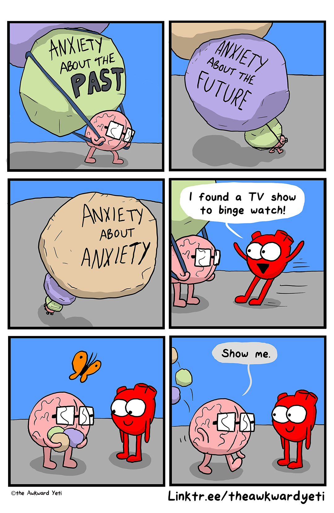

{}
📄 <a href="https://doi.org/10.1101/2025.03.26.645574" target="_blank">Read the Paper</a>  
🖼 <a href="/assets/Braun_HEP_CNS.pdf" target="_blank">View the Poster</a>

### TL;DR 
I used EEG and unsupervised machine learning techniques to analyze how
the brain processes internal signals (interoception) and its link to anxiety. I
found that the brain is less sensitive to internal signals during high energy
states, a pattern that was amplified during states of anxiety---insights from
this project are relevant to stress detection and human-centered design.

### Key Skills
* 🧹 **Data Wrangling** – Cleaned high-dimensional EEG & physiological data
* 📊 **Exploratory Data Analysis** – Examined relationships between physiological and behavioral measures
* 🤖 **Machine learning** – Applied signal separation for artifact removal and clustering to extract insights
* 📈 **Visualization** – Created clear, insight-driven plots

### What I Learned
How to extract meaningful signals from noisy biological data, a skill
transferable to real-world time-series analysis (wearables, health tech, user
behavior modeling).

{}

Sometimes life is angsty. We've all been there---you're about to talk in front
of a group, have a difficult conversation with someone, or do some task where a
mistake would be really bad. While it might be healthier not to avoid anxiety,
sometimes it's just easier to reach for a distraction. What you may not know is
that your brain might subconsciously be trying to avoid anxiety as well.


<div class="figure" style="text-align: center">

<p class="caption"><span id="fig:unnamed-chunk-1"></span>Figure 1: Distraction is an easy way to avoid feeling anxiety.</p>
</div>

```
## [1] "/home/dave/Dropbox/post_doc/professional/career/davebraundotnet/blogdown/content/post/hep"
```

## <u>What we were interested in </u>
### We wanted to look at how the brain responds to heartbeats across different states of anxiety and energy

Previous research suggests that anxiety disrupts our brain's *subconsious*
sensitivity to bodily signals, a sensitivity referred to as *interoception*.
[^anx] Interoception is our brain's way of sensing and regulating many of the
body's functions, such as breathing and responding to heart rhythms.

[^anx]: Pang, J., Tang, X., Li, H., Hu, Q., Cui, H., Zhang, L., Li, W., Zhu, Z., Wang, J., & Li, C. (2019). Altered Interoceptive Processing in Generalized Anxiety Disorder—A Heartbeat-Evoked Potential Research. Frontiers in Psychiatry, 10, 616. https://doi.org/10.3389/fpsyt.2019.00616

Differences in interoception have also been linked to differences in one's sense
of energy or activation[^coll]<sup>,</sup>[^fourcade]---a sense we'll refer to
as *subjective arousal*. Subjective arousal---much like anxiety and
interoception---is continually and spontaneously fluctuating, even when people
are just at rest. But no previous study has looked at how subjective arousal,
anxiety, and interoception spontaneously fluctuate with each other at rest.

[^coll]: Coll, M.-P., Hobson, H., Bird, G., & Murphy, J. (2021). Systematic review and meta-analysis of the relationship between the heartbeat-evoked potential and interoception. Neuroscience & Biobehavioral Reviews, 122, 190–200. https://doi.org/10.1016/j.neubiorev.2020.12.012

[^fourcade]: Fourcade, A., Klotzsche, F., Hofmann, S. M., Mariola, A., Nikulin, V. V., Villringer, A., & Gaebler, M. (2024). Linking brain–heart interactions to emotional arousal in immersive virtual reality. Psychophysiology, e14696. https://doi.org/10.1111/psyp.14696

We wanted to look at how the brain responds to bodily signals---specifically,
heartbeats---during spontaneous fluctuations in subjective arousal when people
are at rest, and how this interaction might be different for those low vs. high
in anxiety. How these processes play out at rest might be important because
certain brain networks are typically only active at rest, and these networks
contribute to patterns like rumination and worry that feed into anxiety.
[^kucyi]

Understanding how the brain shifts interoception in response to changing
subjective arousal states during rest might help us better understand processes
that underlie anxiety.

[^kucyi]: Kucyi, A., Kam, J. W. Y., Andrews-Hanna, J. R., Christoff, K., & Whitfield-Gabrieli, S. (2023). Recent advances in the neuroscience of spontaneous and off-task thought: Implications for mental health. Nature Mental Health, 1(11), 827–840. https://doi.org/10.1038/s44220-023-00133-w

## <u>How we did it</u>
### We measured electrical activity from the brain and heart during rest and occassionally asked people how they were feeling

A precise way to measure neural interoception is through what's called the
*heartbeat evoked potential* (HEP), which is basically the brain's
electrophysiological response to heartbeats.[^hep] Your brain is constantly emitting
electricity (emanating from the communication between neurons), and when the brain's
electrical response is high following a heartbeat, that's thought to reflect
higher levels of neural interoceptive sensitivity to the heart.

[^hep]: Park, H.-D., & Blanke, O. (2019). Heartbeat-evoked cortical responses: Underlying mechanisms, functional roles, and methodological considerations. NeuroImage, 197, 502–511. https://doi.org/10.1016/j.neuroimage.2019.04.081

Participants (51) came into our lab and completed a survey indicating their
level of state anxiety, or how much anxiety they were experiencing *in that
moment*. We then fitted them with an EEG cap to measure their neural electrical
signals. This EEG cap included 31 scalp electrodes plus an electrode that we
placed on participants' back (ECG) to measure their heartbeat activity (see
*Figure* <a href="#fig:eeg">2</a>).

<div class="figure">

<p class="caption"><span id="fig:eeg"></span>Figure 2: (A) Cartoonized illustration of EEG cap and (B) placement of EEG electrodes in the experiment according to the 10-20 coordinate system</p>
</div>

Participants stared at a blank screen and were told to let their minds wander
freely. Every so often, a set of questions (ie, a *thought probe*) appeared
asking participants to report different aspects of their experience. Most
important was the question asking about their level of *subjective arousal*,
which includes feelings of energy linked to emotion, and participants gave
ratings on a scale from 0 (completely deactivated) to 100 (completely activated;
see *Figure* <a href="#fig:design">3</a>A).

<div class="figure" style="text-align: left">

<p class="caption"><span id="fig:design"></span>Figure 3: Trial sequence and analysis approach. (A) Participants were instructed to let their minds wander freely while viewing a blank screen and occasionally reported on aspects of their experience (such as their level of subjective arousal). (B) Brain EEG signals before a thought probe and directly after heartbeats were averaged together, separated by a median split in subjective arousal, and submitted to a whole-brain analysis (ie, cluster-based permutation analysis).</p>
</div>


To calculate the HEP, I isolated the 10 s period before the onset of a thought
probe and extracted the EEG signals (from all 31 electrodes) that occurred
directly after a heartbeat (see *Figure* <a href="#fig:design">3</a>*B*). I then separated
the 10 s pre-probe periods according to whether the subjective arousal rating
obtained during the thought probe was high or low (based on a
within-participants median split on subjective arousal). 

Finally, I averaged across the high vs. low levels of subjective arousal
(collapsing across heartbeats and probes), which gave me one averaged brain
signal value for timepoints immediately following a heartbeat, for each EEG
channel, for each subjective arousal condition, across all participants. In
other words, we had for each participant an array of shape (timepoints x channel
x condition), or (100 x 31 x 2).

Ultimately, we wanted to know how interoceptive sensitivity to cardiac signals (as measured
with HEPs) is different in periods leading up to self-reported high vs. low
states of subjective arousal. To assess this, I took those arrays defined
in the previous paragraph and conducted a whole brain analysis using what's
called a **cluster-based permutation test**.

Cluster-based permutation test is a super powerful and flexible data-driven
method for finding differences between conditions in high-dimensional space. In
our example, the conditions are a median split on subjective arousal ratings,
each thought probe was labelled as "high" or "low" subjective arousal. The high
dimensional space is the remaining (time x channels) array of EEG data for each
participant. In short, we want to find whether EEG voltage is different across
high vs. low levels of subjective arousal conditions at any timepoint(s) and for
any EEG channel(s).

<details>
<summary><strong style="color:#7aa6b8;"><u>Expand this section</u> to optionally
read more about cluster-based permutation test and see how I implemented it with
code.</strong></summary>

<h2 style="color:#7aa6b8;"><u>Technical spotlight</u>: Cluster-based permutation testing</h2>

### What is a cluster-based permutation test?

We're trying to find a meaningful pattern in brain data, but brain data is **massive**. In our case, we're looking across 6,200 data points. If we tested each one individually, we'd almost certainly get false positives (random noise that *looks* meaningful).

A **cluster-based permutation test** helps solve this.

**The core idea:**

Instead of asking "is this single time point significant?", we ask:

> Are there **clusters** of nearby data points that are all showing an effect?

If a real difference exists, we expect it to show up not just as a blip, but as a **spatially or temporally coherent cluster.**

**How it works:**

1. **Compute the actual data difference** between two groups (eg, high vs. low subjective arousal) at every point in time or space.
2. **Identify clusters** of adjacent points that pass some basic threshold (eg, t-values > 2).
3. **Calculate a cluster-level statistic** (like the sum of t-values) for each cluster.
4. **Randomly shuffle** the group labels many times (eg, 5,000 permutations) and repeat steps 1-3 each time.
5. **Compare your original clusters** to the shuffled ones. If a real cluster is bigger than 95% of the ones you'd see by chance, it's considered statistically significant.

What makes this approch so powerful is that it doesn't rely on strict
**assumptions** about what the data would look like if there were no effect (ie,
a null distribution). Instead, it builds a null distribution directly from the
data. This allows us to compare many data points over an *arbitrary* number of
dimensions to look for significant effects, making cluster-based permutation
testing the perfect tool for finding differences in our brain data.

### How I implemented it

To make the cluster-based permutation test flexible and reproducible, I wrote a collection of functions in both Python and R and coordinated them with R's fancy [reticulate](https://rstudio.github.io/reticulate/) package. The Python functions actually ran the cluster test using [`mne.stats.spatio_temporal_cluster_test`](https://mne.tools/stable/generated/mne.stats.spatio_temporal_cluster_test.html), and the R functions were mostly for summarizing the result. I'm highlighting here the main Python function doing most of the work, but you can see the full set of functions on GitHub (for [Python](https://gist.github.com/dbraun31/23299f56013abba510e23014bc1d19d8) and [R](https://gist.github.com/dbraun31/8396dad9a13fa4fac9746a3108d6c94e)).

The whole main Python function:

<div class="show-default"></div>

```python
from pathlib import Path
import pickle
from mne.stats import spatio_temporal_cluster_test

def permutation_cluster_test(item,
                             low_anchor,
                             bads,
                             time_window_min=0.25,
                             initial_alpha=0.01,
                             path=Path('analysis/data/derivatives/hep/06-evoked-clean')):
                                 
    '''
    Conducts a permutation-based clustering analysis across a median split of
    item, analyzing time points from time_window_min to end of epoch. 
    
    --- PARAMETERS ---
    ------------------
    item (str): Item name
    low_anchor (str): Name of low anchor on the scale (all lowercase)
    time_window_min (float): Analyze time points after this value
    initial_alpha (float): Alpha for finding initial clusters
    path (pathlib.Path): Path to directory containing data
    
    --- RETURNS ---
    ---------------
    out (dict) containing results of permutation test:
        t_obs: (N_timepoints x M_channels) matrix with t values as elements
        clusters: list of (array(time_idx, ...), array(channel_idx, ...)) tuples of all found clusters
        p_values: np.array of shape (N_clusters,) where each element is a p value
    '''

    # Open dictionary 
    assert(isinstance(item, str))
    file = 'eeg_dict_{}.pkl'.format(item)
    full_path = path / Path(file)
    with open(full_path, 'rb') as f:
        dic = pickle.load(f)
    # Ensure bads is a list of ints
    if isinstance(bads, list):
        bads = [int(x) for x in bads]
    else:
        bads = [int(bads)]
        
    # Get numpy arrays of shape (subjects, time, chans) for each condition
    low, high = _format_for_clustering(dic, low_anchor, bads)
    
    # Get a sample evoked object for computing distances
    probe_set = dic[list(dic.keys())[0]][low_anchor]
    sample_evoked = probe_set[list(probe_set.keys())[0]]
    adjacency, _ = find_ch_adjacency(sample_evoked.info, 'eeg')
    
    # Get the first index of timepoint thats >= the min timepoint
    time_window_idx = [i for i, e in enumerate(sample_evoked.times) if e >= time_window_min][0]
    times = sample_evoked.times[time_window_idx:]
    channels = sample_evoked.info['ch_names']
    
    # Format data as list of arrays
    X = [low[:, time_window_idx:, :],
        high[:, time_window_idx:, :]]
        
    # Configure parameters
    df = low.shape[0] - 1
    t_crit = stats.t.ppf(1 - initial_alpha, df)
    tail = 0 
    
    # Run test
    t_obs, clusters, p_values, _ = spatio_temporal_cluster_test(
        X,
        n_permutations=1000,
        threshold=t_crit,
        tail=tail,
        n_jobs=None,
        seed = 1510,
        buffer_size=None,
        adjacency=adjacency,
        stat_fun=_my_t
    )
    
    out = {'t_obs': t_obs, 'clusters': clusters, 'p_values': p_values, 
    'times': times, 'channels': channels}
    
    return out
```

Let's zoom into the important stuff. 

The actual cluster-based permutation test is being run with this code:

<div class="show-default"></div>

```python
# Run test
t_obs, clusters, p_values, _ = spatio_temporal_cluster_test(
    X,
    n_permutations=1000,
    threshold=t_crit,
    tail=tail,
    n_jobs=None,
    seed = 1510,
    buffer_size=None,
    adjacency=adjacency,
    stat_fun=_my_t
)
```

This function (`spatio_temporal_cluster_test`) comes from the [MNE library](https://mne.tools), which is an excellent set of EEG/MEG analysis tools written for Python. Let's step through the important input arguments.

**The input data**

The input data (`X`) needs to be formatted as a list of arrays, where each array in the list is data from one of the conditions---in our case, the two subjective arousal conditions (high vs. low). This formatting is done by the following lines of code:


<div class="show-default"></div>

```python
# Get numpy arrays of shape (subjects, time, chans) for each condition
low, high = _format_for_clustering(dic, low_anchor, bads)

# Format data as list of arrays
X = [low[:, time_window_idx:, :],
    high[:, time_window_idx:, :]]
```

I'm first calling one of my other functions (not shown above) to format the relevant data into two arrays split by subjective arousal condition. These arrays represent the data across each timepoint and channel for each subject. Next, I'm concatenating these two arrays into a list---taking only a subset of the time window with `time_window_idx`---which serves as our final input data `X`. We're analyzing only a subset of the time window because we want to conduct our statistics only on those measurements that occur at least 250 ms after each heartbeat, which is to ensure that heartbeat activity doesn't contaminate the neural activity we're interested in analyzing.

**The statistical hyperparameters**

We need to configure a number of statistical hyperparameters that will influence how the cluster test algorithm runs. We first need to decide on what is a significant threshold for forming a cluster in the first place (ie, the `threshold` input argument). Since we're only comparing two conditions within participants, the statistical test we use to compute this threshold is a *paired-samples t test* (which is defined in the `_my_t` function and passed to the `stat_fun` input argument of the cluster analysis).

For each of the many, many comparisons across data points, the algorithm computes one t test, and the threshold we set determines whether the resulting t value is considered significant. Significant t values that are adjacent to one another in data space are considered to be a "cluster". For this type of test, it's common to use an alpha value (ie, false positive rate) of 0.01 as a cluster forming threshold. But we need to convert that alpha to a t value, and for that we use the quantile function of the t distribution (ie, the function that maps probability values to t values, or the inverse cumulative distribution function):

<div class="show-default"></div>


```python
# Configure parameters
df = low.shape[0] - 1
t_crit = stats.t.ppf(1 - initial_alpha, df)
tail = 0 
```

The degrees of freedom (df) is the number of participants minus 1, and we
subtract alpha from 1 to calculate the cumulative density between the tail of
the t distribution and the alpha value. Finally, `tail=0` tells the algorithm we
want to perform a two-tailed test, meaning either condition can have greater EEG
voltage than the other.

The algorithm returns the data points of all the clusters found, along with the
t values across all data points, and cluster-specific p values. If a cluster has
a *cluster-level* p value of less than .05, we know there was a significant difference across
subjective arousal conditions during the cluster's time period and for that
cluster's channels. Below (*Figure* <a href="#fig:heatmap">4</a>) is a heat map of the t values across all data points
(with a preview of a signifcant cluster):


```r
# Read in data
m <- readRDS('post_data/cluster_result.rds')

# Parse time and channels, make data frame
channels <- colnames(m$eeg)[which(colnames(m$eeg)=='Fp1'):ncol(m$eeg)]
times <- unique(m$eeg$time)
times <- times[times >= .25]
ts <- as.data.frame(m$result$t_obs)
colnames(ts) <- channels
ts <- cbind(data.frame(time = times, ts))

# Configure colors and plot
blues <- brewer.pal(5, 'Blues')
blues_g <- colorRampPalette(c(blues[1], blues[5]))(100)

ts %>% 
    gather(channel, t, Fp1:POz) %>% 
    mutate(channel = factor(channel, levels = rev(channels))) %>% 
    ggplot(aes(x = time, y = channel)) + 
    geom_tile(aes(fill = t)) + 
    geom_rect(aes(ymin = 'C3', ymax = 31.5, xmin = .31, xmax = .38), fill = NA, color = 'green', linetype = 'dashed',
              linewidth = 1.5) +
    scale_fill_gradientn(colors = blues_g) + 
    labs(
        x = 'Time post heartbeat (s)',
        y = 'EEG Channels',
        fill = 't value'
    ) + 
    theme_bw() + 
    theme(panel.grid = element_blank(),
          axis.ticks = element_blank())
```

<div class="figure">
}}index_files/figure-html/heatmap-1.png" alt="Heat map of t values from cluster-based permutation analysis across time and EEG channels. Time is relative to heartbeat onset. First letter of channel suggests it's position on the scalp (ie, F=frontal, C=central, T=temporal, P=parietal, O=occipital). Darker blues indicate higher t values, revealing a larger difference in the EEG signal between subjective arousal conditions. Green dashed lines highlight the significant cluster." width="100%" />
<p class="caption"><span id="fig:heatmap"></span>Figure 4: Heat map of t values from cluster-based permutation analysis across time and EEG channels. Time is relative to heartbeat onset. First letter of channel suggests it's position on the scalp (ie, F=frontal, C=central, T=temporal, P=parietal, O=occipital). Darker blues indicate higher t values, revealing a larger difference in the EEG signal between subjective arousal conditions. Green dashed lines highlight the significant cluster.</p>
</div>


<strong style="color: #7aa6b8;">That's it for the technical spotlight! Now back to the main post.</strong>

</details>

### Research questions

In this post, I address three questions with the analyses:

1. How was our measure of subjective arousal related to physiological arousal?
2. How does interoception (as measured with HEP) vary across states of subjective arousal?
3. How does the relationship between interoception and subjective arousal change depending on state anxiety?

## <u>What we found</u>

### 1. Subjective arousal was unrelated to physiological arousal and somewhat related to other dimensions of experience

To first get a better sense of what we were really measuring with our subjective
arousal scale, I looked at how subjective arousal ratings compared to (i) more
traditional measures of objective, physiological arousal (such as heartrate),
and (ii) how subjective arousal related to other dimensions of ongoing
experience that we measured with our thought probes (such as tendency to think
about the future). *Figure* <a href="#fig:correlations">5</a> shows participant-specific 
correlations between subjective arousal and both heartrate and future thinking.


```r
# Import data
d <- read.csv('post_data/MW_EEG_behavioral.csv')
bads <- c(10, 13, 14)
d <- d[!d$subject %in% bads,]
ecg <- read.csv('post_data/MW_ECG_summary.csv')

# Mean imputation on very few missing values
d <- d %>% 
    group_by(subject) %>% 
    # Mean imputation
    mutate(trial = 1:(n()), arou = ifelse(!is.na(arou), arou, mean(arou, na.rm=TRUE))) %>% 
    ungroup() %>% 
    select(subject, trial, arou, fut) 

# Summarize heart metric
heart <- ecg %>% 
    rename(trial = probe) %>% 
    mutate(trial = as.integer(gsub('Probe', '', trial)),
           timepoint = sample / 250) %>% 
    mutate(hr = 60 / (timepoint - lag(timepoint))) %>% 
    group_by(subject, trial) %>% 
    summarize(hr = mean(hr, na.rm=TRUE)) %>% 
    inner_join(d) 
## `summarise()` has grouped output by 'subject'. You can override using the
## `.groups` argument.
## Joining with `by = join_by(subject, trial)`


# Compute summaries for viz
sd <- heart %>% 
    gather(metric, measure, hr, fut) %>% 
    group_by(subject, metric) %>% 
    summarize(r = cor.test(measure, arou)$estimate,
              ci_l = cor.test(measure, arou)$conf.int[1],
              ci_h = cor.test(measure, arou)$conf.int[2],
              p = cor.test(measure, arou)$p.value) %>% 
    mutate(sig = case_when(
        p < .001 ~ 'p < .001',
        p < .01 ~ 'p < .01',
        p < .05 ~ 'p < .05',
        p >= .05 ~ 'N.S.'
    )) %>% 
    mutate(sig = factor(sig, levels = c('N.S.', 'p < .05', 'p < .01', 'p < .001')))
## `summarise()` has grouped output by 'subject'. You can override using the
## `.groups` argument.
    

# ---  COMPUTE AGGREGATE STATS --- #

# Use Fisher Z to transform correlations to unbounded space
fisherz <- function(r) {
    return(0.5 * log((1 + r) / (1 - r)))
}

sd$z <- fisherz(sd$r)
N <- length(unique(sd$subject))

# Aggregate correlation statistics
stats <- sd %>% 
    group_by(metric) %>% 
    summarize(m = mean(r), se = sd(r) / sqrt(N), t = t.test(r, mu=0)$statistic,
              df = t.test(r, mu=0)$parameter, p = t.test(r, mu=0)$p.value,
              bf =  (extractBF(ttestBF(r, mu=0))$bf)) %>% 
    mutate(p_code = ifelse(p < .001, '< .001', paste0('= ', round(p, 3))),
           bf = ifelse(metric=='fut', bf, 1 / bf)) %>% 
    mutate(r = -1, subject = c(1, 24),
           label = paste0('p ', p_code, c('\nBF Alt = ', '\nBF Null = '), round(bf, 2))) 

metric_order <- c('hr', 'fut')
stats$metric <- factor(stats$metric, levels = metric_order)
stats$metric <- recode(stats$metric, `hr` = 'Heart rate', `fut` = 'Future thinking')
           
colors <- brewer_pal(palette = 'RdBu')(10)[c(1, 10, 8, 6)]

# Visualize
p3 <- sd %>% 
    mutate(metric = factor(metric, levels = metric_order)) %>% 
    mutate(metric = recode(metric, `hr` = 'Heart rate', `fut` = 'Future thinking')) %>% 
    ggplot(aes(x = reorder_within(subject, r, metric), y = r)) + 
    geom_hline(yintercept = 0, linetype = 'dashed') + 
    geom_errorbar(aes(ymin = ci_l, ymax = ci_h, color = sig), width = .2, linewidth = .5) +
    geom_point(aes(color = sig), size = .5) + 
    geom_text(data = stats, aes(label=label), size = 3, hjust = 0) + 
    scale_color_manual(values = colors) +
    labs(
        x = 'Participant',
        y = 'Within-participant correlation with subjective arousal',
        color = ''
    ) + 
    scale_x_reordered() +  
    scale_y_continuous(breaks = c(-1, 0, 1), labels = c(-1, 0, 1), limits = c(-1, 1)) + 
    coord_flip() + 
    facet_wrap(~metric, scales = 'free', ncol = 3) + 
    theme_bw() + 
    theme(axis.ticks = element_blank(),
          axis.text.y = element_blank(),
          strip.background = element_rect(fill = NA),
          panel.grid = element_blank(),
          legend.position = c(.39, .3),
          legend.key.size = unit(.2, 'cm'),
          legend.text = element_text(size = 8),
          legend.spacing.y = unit(0, 'pt'),
          legend.title = element_blank(),
          text = element_text(size = 14))

p3
```

<div class="figure">
}}index_files/figure-html/correlations-1.png" alt="Participant-level correlations between subjective arousal, tendency to think about the future, and heartrate. Bayes factors and p values characterize a one-sample t test against zero." width="100%" />
<p class="caption"><span id="fig:correlations"></span>Figure 5: Participant-level correlations between subjective arousal, tendency to think about the future, and heartrate. Bayes factors and p values characterize a one-sample t test against zero.</p>
</div>

We can see that, for just about all participants, ratings of subjective arousal
are largely unrelated to their average heart rate. We can also see that, for
many participants, thinking about the future was associated with higher
subjective arousal ratings. This makes sense if thinking about the future is
energizing or stressful.

### 2. Interoceptive sensitivity to cardiac signals is stronger during states of lower subjective arousal

To assess whether interoception to cardiac signals changes based on subjective arousal, we examined the results of the cluster-based permutation test, and found one significant cluster. This cluster occurred largely over frontal electrodes about 350 ms post heartbeat.


```r
library(ggpubr)
source('visualize_clusters.r')
## 
## Attaching package: 'arrow'
## The following object is masked from 'package:lubridate':
## 
##     duration
## The following object is masked from 'package:utils':
## 
##     timestamp
## 
## Attaching package: 'eegUtils'
## The following object is masked from 'package:stats':
## 
##     filter
## here() starts at /home/dave/Dropbox/post_doc/professional/career/davebraundotnet/blogdown
m <- readRDS('post_data/cluster_result.rds')
cluster_id <- which(m$result$p_values < .05)
topo <- plot_topo(m, cluster_id, n_breaks = 1, nrow = 1)
## Joining with `by = join_by(channel)`
## Warning in geom_topo(chan_markers = "text", aes(fill = t_statistic, label =
## electrode)): Ignoring unknown aesthetics: label
## Warning in geom_topo(chan_markers = "text", aes(fill = t_statistic, label = electrode)): Ignoring unknown aesthetics: fill and label
## Ignoring unknown aesthetics: fill and label
## Ignoring unknown aesthetics: fill and label
## Warning in geom_topo(chan_markers = "text", aes(fill = t_statistic, label =
## electrode)): Ignoring unknown aesthetics: fill
## Warning in geom_topo(chan_markers = "text", aes(fill = t_statistic, label =
## electrode)): Ignoring unknown aesthetics: fill and label


channels <- m$result$channels[m$result$clusters[[2]][[2]] + 1]
times <- m$result$times[m$result$clusters[[2]][[1]] + 1]
d <- m$eeg 


N <- length(unique(d$subject))

pd <- d %>% 
    gather(channel, voltage, Fp1:POz) %>% 
    filter(channel %in% channels) %>% 
    group_by(subject, condition, time) %>% 
    summarize(voltage_ = mean(voltage)) %>% 
    group_by(condition, time) %>% 
    summarize(voltage = mean(voltage_), se = sd(voltage_) / sqrt(N)) 
## `summarise()` has grouped output by 'subject', 'condition'. You can override
## using the `.groups` argument.
## `summarise()` has grouped output by 'condition'. You can override using the
## `.groups` argument.

rib <- pd %>% 
    filter(time %in% times) %>% 
    group_by(time) %>% 
    summarize(ymin = min(voltage, na.rm = TRUE), ymax = max(voltage, na.rm = TRUE))

low <- '#FC8D59'
high <- '#91BFDB'

ts <- pd %>% 
    ggplot(aes(x = time, y = voltage)) + 
    geom_rect(aes(xmin = .25, xmax = .650, ymin = min(voltage), ymax = max(voltage)),
               color = 'steelblue', fill = NA, linetype = 'dashed') + 
    geom_ribbon(data = rib, aes(ymin = ymin, ymax = ymax, 
                                xmin = times[1], xmax = times[length(times)], y=1),
                alpha = .6, fill = 'green') + 
    geom_ribbon(aes(ymin = voltage - se, ymax = voltage + se, fill = condition), alpha = .3) + 
    geom_line(aes(color = condition)) +
    labs(
        title = 'Heartbeat evoked potential (HEP)',
        x = 'Time post heartbeat (s)',
        y = latex2exp::TeX('$EEG Voltage~ (\\mu ~V)$'),
        color = 'Subjective arousal',
        fill = 'Subjective arousal'
    ) + 
    scale_color_manual(values = c(Deactivated = low, Activated = high)) +
    scale_fill_manual(values = c(Deactivated = low, Activated = high)) +
    theme_bw() + 
    theme(axis.ticks = element_blank(),
          panel.grid = element_blank(),
          legend.position = 'bottom')


g <- ggarrange(ts, topo, labels = c('A.', 'B.'), nrow=2)
print(g)
```

<div class="figure">
}}index_files/figure-html/clusterresult-1.png" alt="Main result of cluster-based permutation analysis. (A) The grand averaged timeseries of EEG voltage timelocked to the heartbeat (ie, the HEP). Blue dashed rectangle highlights the time points that were analyzed in the cluster test. Green shaded area highlights the significant cluster. (B) Topographical heat map of t values during the significant time window (at time point 0.328 s post heartbeat). The significant cluster centers on frontal electrodes." width="100%" />
<p class="caption"><span id="fig:clusterresult"></span>Figure 6: Main result of cluster-based permutation analysis. (A) The grand averaged timeseries of EEG voltage timelocked to the heartbeat (ie, the HEP). Blue dashed rectangle highlights the time points that were analyzed in the cluster test. Green shaded area highlights the significant cluster. (B) Topographical heat map of t values during the significant time window (at time point 0.328 s post heartbeat). The significant cluster centers on frontal electrodes.</p>
</div>

*Figure* <a href="#fig:clusterresult">6</a> highlights the significant cluster from the cluster-based permutation analysis. We can see that, on average, EEG voltage was higher (ie, stronger interoception) prior to lower ratings of subjective arousal. This suggests that participants were more sensitive to cardiac signals during periods of lower subjective arousal. 


### 3. The link between interoceptive sensitivity and subjective arousal was amplified for those high in state anxiety

Given the strong links between anxiety and interoception[^anx], we next wanted to look at how this HEP effect we found might be different for those with low vs. high anxiety. At the beginning of the experiment, we collected measures of both trait anxiety (ie, how much anxiety one experiences generally) and state anxiety (ie, how much anxiety one is experience while completing the survey).

If I were to plot that significant green window in *Figure* <a href="#fig:clusterresult">6</a> for each participant, we would see that each participant is different with respect to how strong their link is between interoception and subjective arousal (ie, their HEP effect). We wanted to know whether these differences could be explained by differences in state or trait anxiety.

So, for each participant, I calculated their average HEP effect and correlated it with their anxiety measures:


```r

# --- TOP PANEL --- #
# Individual-level correlations between HEP effect size and survey response

# Select correct data
channels_s <- m$result$channels[m$result$clusters[[2]][[2]] + 1]
times_s <- m$result$times[m$result$clusters[[2]][[1]] + 1]
cluster <- data.frame(time = times_s, channel = channels_s)
cluster$string <- paste(cluster$time, cluster$channel, sep='_')
survey <- read.csv('post_data/MW_EEG_survey.csv')
survey <- survey[, c('subj_id', 'GAD7_Score', 'STAI_Score')]
colnames(survey) <- c('subject', 'gad', 'stai')
d <- m$eeg

# Select appropriate (significant) cluster
hep_s <- d %>% 
    gather(channel, voltage, Fp1:POz) %>% 
    mutate(string = paste(time, channel, sep='_')) %>% 
    filter(string %in% cluster$string, channel %in% channels_s) %>% 
    group_by(subject, condition) %>% 
    summarize(voltage = mean(voltage)) %>% 
    mutate(condition = ifelse(condition == 'Activated', 'High Arousal', 'Low Arousal')) %>% 
    inner_join(survey)
## `summarise()` has grouped output by 'subject'. You can override using the
## `.groups` argument.
## Joining with `by = join_by(subject)`

# Make general summarized data
t <- hep_s %>% 
    spread(condition, voltage) %>% 
    mutate(hep = `Low Arousal` - `High Arousal`) %>% 
    select(-`High Arousal`, -`Low Arousal`) %>% 
    gather(survey, response, gad,stai) %>% 
    mutate(survey = recode(survey, `gad` = 'Trait anxiety', `stai` = 'State anxiety')) 

# Compute group-level correlations
cr <- t %>% 
    group_by(survey) %>% 
    summarize(r = cor.test(hep, response)$estimate,
              df = cor.test(hep, response)$parameter,
              p = cor.test(hep, response)$p.value,
              ci_h = cor.test(hep, response)$conf.int[1],
              ci_l = cor.test(hep, response)$conf.int[2]) %>% 
    mutate(label = paste0('r(', df, ') = ', round(r, 3), '\n95% CI = [', round(ci_l, 3), ', ', 
                          round(ci_h, 3), ']\np = ', round(p, 3)),
           hep = c(-.5, -.5), response = c(39, 10), survey = c('State anxiety', 'Trait anxiety'))

# Visualize correlations
p1 <- t %>% 
    filter(!is.na(response)) %>% 
    ggplot(aes(x = response, hep)) + 
    geom_point() + 
    geom_smooth(method = 'lm') + 
    facet_wrap(~survey, scales = 'free_x') +
    geom_text(data = cr, aes(label = label), hjust = 0, size = 3) + 
    labs(
        x = 'Survey response',
        y = 'Participant-specific\nHEP effect size'
    ) + 
    ylim(-1, 1) + 
    theme_bw() + 
    theme(panel.grid = element_blank(),
          strip.background = element_rect(fill = NA, color = 'black'),
          axis.ticks = element_blank())
    
# --- PANEL 2 --- #
# Visualize median split on EEG timeseries 

# Keep relevant columns
channels_s <- unique(channels_s)
d <- m$eeg
mask1 <- colnames(d) %in% c('subject', 'condition', 'time')
mask2 <- colnames(d) %in% channels_s
d <- d[, (mask1 | mask2)]

# Plot
p2 <- d %>% 
    inner_join(survey[,c('subject', 'stai')]) %>% 
    filter(!is.na(stai), time %in% times) %>% 
    mutate(stai_d = ifelse(stai > median(stai), 'High state anxiety', 'Low state anxiety')) %>% 
    gather(channel, voltage, Fp1:FC5) %>% 
    group_by(subject, time, condition, stai_d) %>% 
    summarize(voltage_ = mean(voltage)) %>%  
    group_by(time, condition, stai_d) %>% 
    summarize(voltage = mean(voltage_), se = sd(voltage_) / sqrt(n())) %>% 
    mutate(stai_d = factor(stai_d, levels = c('Low state anxiety', 'High state anxiety'))) %>% 
    ggplot(aes(x = time, y = voltage)) + 
    geom_ribbon(aes(ymin = voltage - se, ymax = voltage + se, fill = condition), alpha = .3) +
    geom_line(aes(color = condition)) + 
    facet_wrap(~stai_d) + 
    labs(
        x = 'Time post heartbeat (s)',
        y = latex2exp::TeX('$EEG~voltage~(\\mu ~V)$'),
        fill = 'Subjective arousal',
        color = 'Subjective arousal'
    ) + 
    scale_color_manual(values = c(`Activated` = high, `Deactivated` = low)) + 
    scale_fill_manual(values = c(`Activated` = high, `Deactivated` = low)) + 
    theme_bw() + 
    theme(panel.grid = element_blank(),
          strip.background = element_rect(fill = NA, color = 'black'),
          axis.ticks = element_blank(),
          legend.position = 'bottom')
## Joining with `by = join_by(subject)`
## `summarise()` has grouped output by 'subject', 'time', 'condition'. You can
## override using the `.groups` argument.
## `summarise()` has grouped output by 'time', 'condition'. You can override using
## the `.groups` argument.
    
g <- ggarrange(p1, p2, labels = c('A.', 'B.'), nrow = 2)
## `geom_smooth()` using formula = 'y ~ x'
## Warning: Removed 2 rows containing non-finite values (`stat_smooth()`).
## Warning: Removed 2 rows containing missing values (`geom_point()`).
    

print(g)
```

<div class="figure">
}}index_files/figure-html/anxietycor-1.png" alt="Participant-level associations between HEP effect size and self-reported anxiety ratings. (A) Correlations with HEP effect size for both state (left) and trait (right) anxiety. (B) EEG grand averaged timeseries broken by a median split on state anxiety." width="100%" />
<p class="caption"><span id="fig:anxietycor"></span>Figure 7: Participant-level associations between HEP effect size and self-reported anxiety ratings. (A) Correlations with HEP effect size for both state (left) and trait (right) anxiety. (B) EEG grand averaged timeseries broken by a median split on state anxiety.</p>
</div>
We can see that for state (but not trait) anxiety, there is a significant,
positive correlation with HEP effect size (<i>Figure</i> <a href="#fig:anxietycor">7</a>). This
suggests that, as people are feeling more anxious in the moment, their
sensitivity to cardiac signals is more coupled with their momentary changes in
subjective arousal.


## <u>What it means</u> 

### As your subjective arousal increases, your brain becomes more sensitive to your heart signals---but if you're higher in anxiety, that boost in sensitivity is even stronger

We found that the brain's response to heartbeats changes depending on how
energized you feel—and that this effect is different for people with higher
anxiety. When people were in a more amped-up state (what we’re calling high
subjective arousal), their brains showed a stronger reaction to heartbeats. And
for folks with high anxiety, this pattern was amplified.

So what does that mean, practically?

It suggests that when your energy level shifts—even just quietly, while you’re
resting—your brain is tuning in to your body in a different way. And if you’re
someone who struggles with anxiety, your brain might be tuning in differently
altogether.

This matters because a lot of anxiety happens at rest, when we’re left alone
with our thoughts. The brain networks that light up during rest are also the
ones tied to rumination, worry, and “what if” spirals. Our results suggest that
these moments of rest may not be as neutral as they seem: your brain is actively
tracking how your body feels, and if you're anxious, it might be tracking
differently.

In the future, this kind of research could inform better mental health tools.
Imagine a wearable that doesn’t just track your heart rate, but notices when
your brain’s response to your body changes in a way that predicts anxiety. Or an
app that could nudge you toward a calming activity right when your internal
signals suggest you're about to start spiraling.

More broadly, this work shows that our internal world—how we feel inside—has a
real, measurable footprint in the brain. It reinforces the idea that emotions
aren’t just things we talk about in therapy—they’re deeply embedded in how our
body and brain talk to each other. And that connection might be key to
understanding not just anxiety, but how we can better support mental health in
everyday life.

[Back to homepage.](https://davebraun.net)
